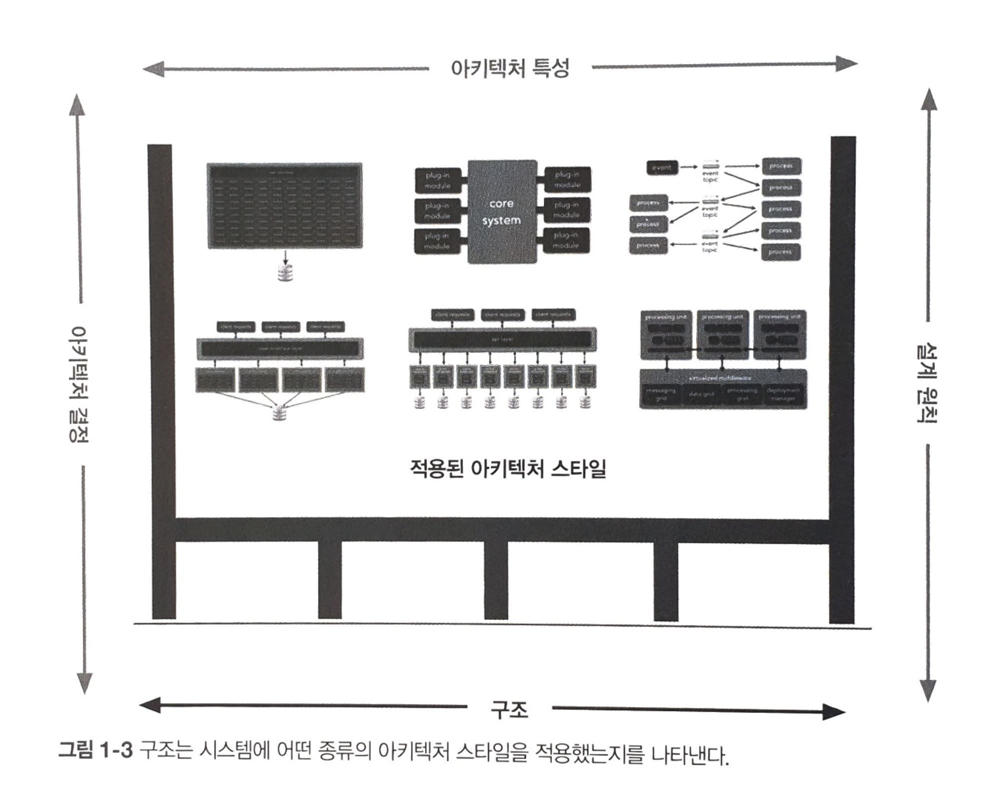
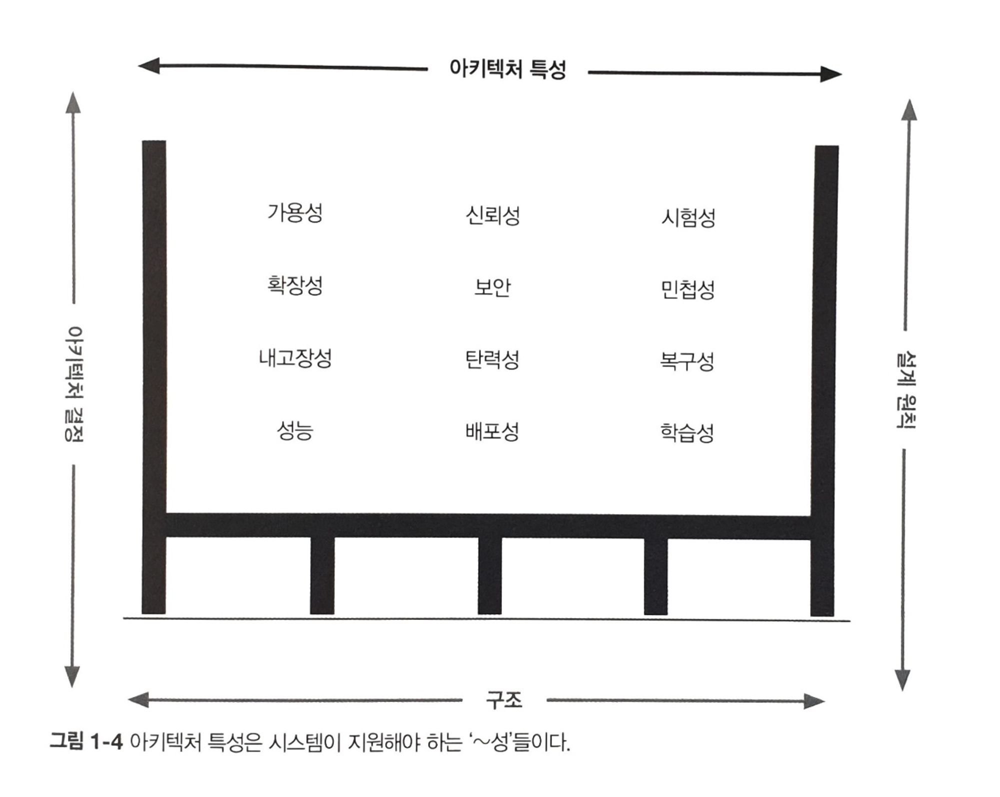
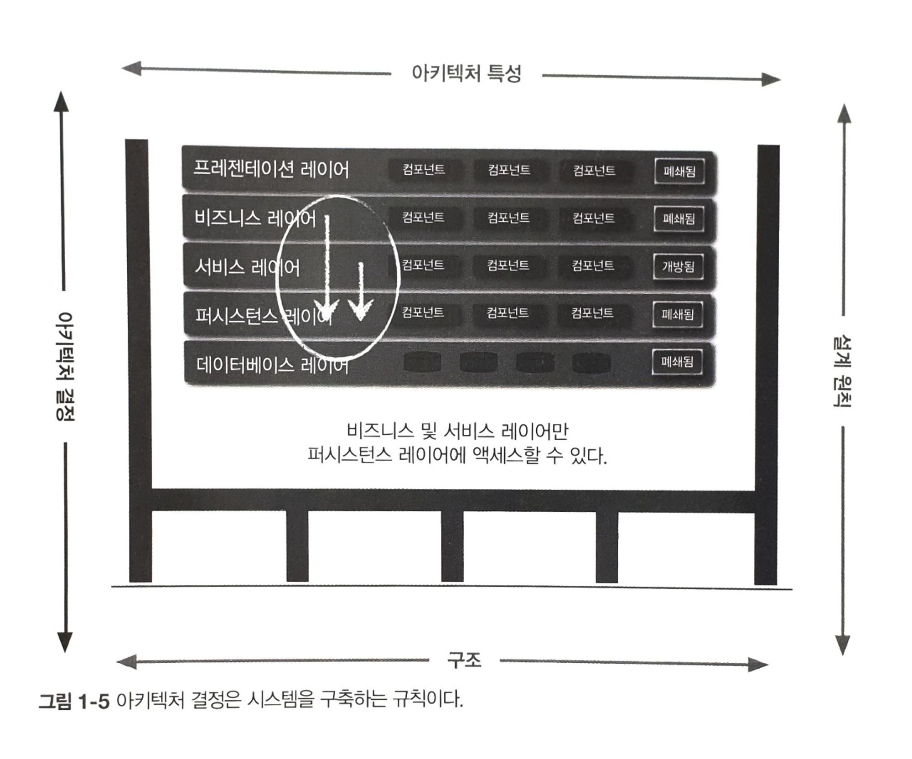
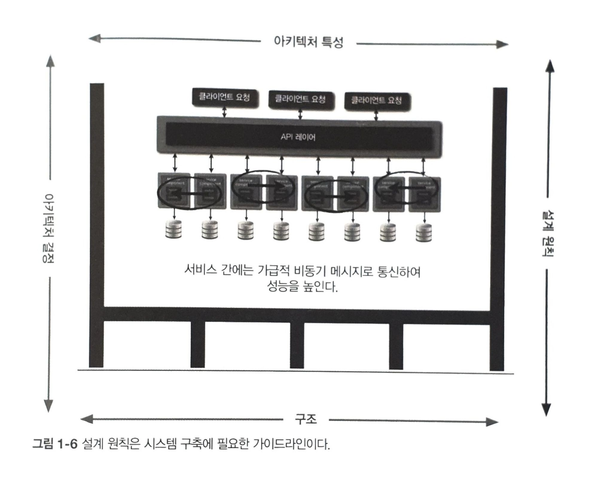

## 1장. 서론

책의 초반에는 아키텍트와 개발자를 구분해서, '아키텍트'라는 직무는 무엇을 하고 무엇을 하지 말아야하는가?를 설명한다
우리나라에서는 이런 구분이 딱히 자리잡지 않은 것 같지만, 내가 하고 있는게 아키텍트 task인지, 개발자의 task인지를 인지하고 있는 것은 큰일을 쪼개서 진행하는데 도움이 될 것 같다

### 소프트웨어 아키텍처란?

아키텍처는

* 아키텍처 특성(architecture characteristic)
* 아키텍처 결정(architecture decision)
* 설계 원칙(design principle)

결합된 구조다(structure)

{width="800" height="300"}
{width="800" height="300"}
{width="800" height="300"}
{width="800" height="300"}

아키텍처 특성은 소프트웨어 아키텍처를 다른 관점에서 바라본 것으로, 일반적으로 시스템의 기능과 직교하는(orthogonal) 시스템의 성공 기준(success criteria)을 결정한다.

아키텍처 결정은 시스템 구축에 필요한 규칙들을 정한 것이다. 가령, 아키텍트가 ‘레이어드(layered)’(계층화) 아키텍처에서는 프레젠테이션 레이어가 데이터베이스를 직접 호출하지 못하게 비즈니스와 서비스 레이어에서만 데이터베이스에 액세스 할 수 있다고 결정하는 식이다. 아키텍처 결정은 시스템의 제약조건(constraint)을 형성하며, 개발자가 해도 되는 것과 하지 말아야 할 것을 알려준다.

아키텍처 결정이 반드시 지켜야 할 규칙이라면 설계 원칙은 가이드라인(guideline)이다. 예를 들어 마이크로서비스 아키텍처의 성능 향상을 위해 서비스 간 통신은 비동기 메시징을 활용해야 한다고 기술하는 것이 설계 원칙이다. 서비스간 통신에 관한 모든 조건과 구현 방안을 아키텍처 결정(규칙)으로 다룰 수는 없기에 특정 환경에서 개발자가 더 적합한 (REST나 gRPC 같은) 통신 프로토콜을 선택할 수 있도록 우선 권장하는 방법에 관한 가이드를 설계 원칙으로 제공하는 것이다.

### 아키텍트에게 기대하는 것들. do / do not

1. 아키텍트는 아키텍처와 설계 원칙을 결정하고 팀, 부서 뿐만 아니라 회사 전체의 기술 결정을 가이드하는 사람이다. 첫 번째 요구사항의 키워드는 ‘가이드’이다.
    1. 아키텍트는 기술 선택을 가이드(guide)하는 사람이지 정해주는(specify) 사람이 아니다.
2. 아키텍트는 아키텍처 결정과 설계 원칙의 컴플라이언스를 보장해야 한다.
    1. 컴플라이언스 보장이란, 아키텍트가 정의하고 문서화하여 전달한 아키텍처 결정과 설계 원칙들을 개발팀이 제대로 준수하고 있는지 지속적으로 확인한다는 뜻이다.
    2. 가령, 프리젠테이션 레이어를 제외한 비즈니스 레이어와 서비스 레이어만 데이터베이스 액세스가 가능하도록 아키텍트가 결정했다면 프리젠테이션 레이어는 아무리 단순한 데이터베이스 호출이라도 반드시 모든 아키텍처를 거쳐야 통신이 가능하다.
3. 아키텍트는 어느 수준 이상의 비즈니스 도메인 전문가여야 한다.
4. 아키텍트는 기업 내부의 정치적 분위기를 이해하고 적절하게 잘 처신할 줄 알아야 한다.
    1. 협상 기술은 정말 중요하고 또 중요하다.
    2. **아키텍처가 내린 거의 모든 결정은 사람들의 반발에 부딪히기 마련이다. 아키텍처 결정을 실천하려면 당연히 시간과 비용이 들어야 하므로 제품 오너, 프로젝트 관리자, 비즈니스 이해 담당자들의 뭇매를 맞게 될 수 밖에 없다. 따라서 아키텍트는 회사에서 정치를 잘 하면서 대부분의 결정을 사람들이 수용하도록 기본적인 협상 기술을 발휘해야 한다.**

### 엔지니어링 프랙티스(engineering practice)와 소프트웨어 개발 프로세스(process)

"엔지니어링 프랙티스"란 소프트웨어 개발에 있어 구체적이고 실용적인 기법 및 방법론을 의미합니다.
이는 개발 프로세스와 구별되며, 개별적인 업무 수행 방식이나 기술적 접근 방법을 포함합니다. 즉, 엔지니어링 프랙티스는 개발 프로세스의 '어떻게'에 초점을 맞춥니다. 다음은 엔지니어링 프랙티스의 몇 가지 주요 요소들입니다:

* 지속적 통합 (Continuous Integration, CI): 코드 변경사항을 자주 그리고 규칙적으로 메인 브랜치에 병합하는 방식입니다. 이는 소프트웨어의 통합을 쉽고 빠르게 만들며, 버그를 빨리 발견하고 해결하는 데 도움이 됩니다.
* 코드 리뷰: 다른 개발자가 작성한 코드를 검토하는 과정입니다. 코드의 품질을 향상시키고, 버그를 줄이며, 지식 공유를 촉진하는 데 유용합니다.
* 단위 테스트: 소프트웨어의 작은 부분을 독립적으로 테스트하는 것입니다. 이를 통해 개별 컴포넌트가 예상대로 작동하는지 확인할 수 있습니다.
* 리팩토링: 기존의 코드를 변경하여 그 구조를 개선하지만, 외부적인 행동은 변경하지 않는 방식입니다. 코드의 가독성을 향상시키고 유지보수를 용이하게 합니다.
* 자동화된 빌드 및 배포: 개발 과정을 자동화하여 일관성을 유지하고 오류 가능성을 줄이는 방법입니다.

이러한 엔지니어링 프랙티스들은 개발 팀이 효율적으로 작업할 수 있도록 도와주며, 소프트웨어의 품질을 높이는 데 기여합니다.

* 소프트웨어 개발 프로세스 -> 팀 구성, 관리, 회의 진행 방식 등 '팀이 어떻게 작동하는가'에 초점을 맞춘다면,
* 엔지니어링 프랙티스 -> '개별 엔지니어 또는 팀이 실제로 업무를 어떻게 수행하는가'에 초점을 맞춥니다.

> 소프트웨어 개발 프로세스로 스크럼을 하고, 이슈를 관리하고, 업무를 할당받고
> 엔지니어링 프랙티스에 따라서 각자 업무를 실제로 처리한다.
> 개발 엔지니어들이 비슷한 수준의 엔지니어링 프랙티스를 가지는게 중요할 것 같다. 결과물의 수준을 비슷하게 유지하기 위해서라도

### 소프트웨어 아키텍처 법칙

* 소프트웨어 아키텍처 제 1법칙
    - 소프트웨어 아키텍처의 모든 것은 다 트레이드오프다.
    - 아키텍트가 트레이드오프가 아닌 뭔가를 발견했다고 생각했다면 그것은 그가 아직 트레이드오프를 발견하지 못했다는 증거일 가능성이 높다.
* 소프트웨어 아키텍처 제 2법칙
    - ‘어떻게’보다 ‘왜’가 더 중요하다.
