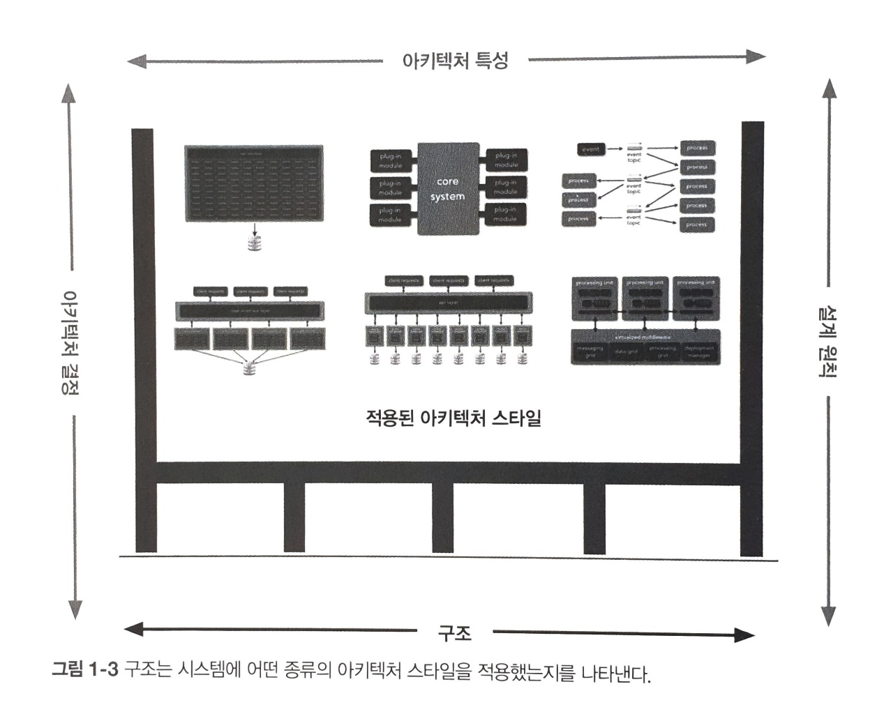
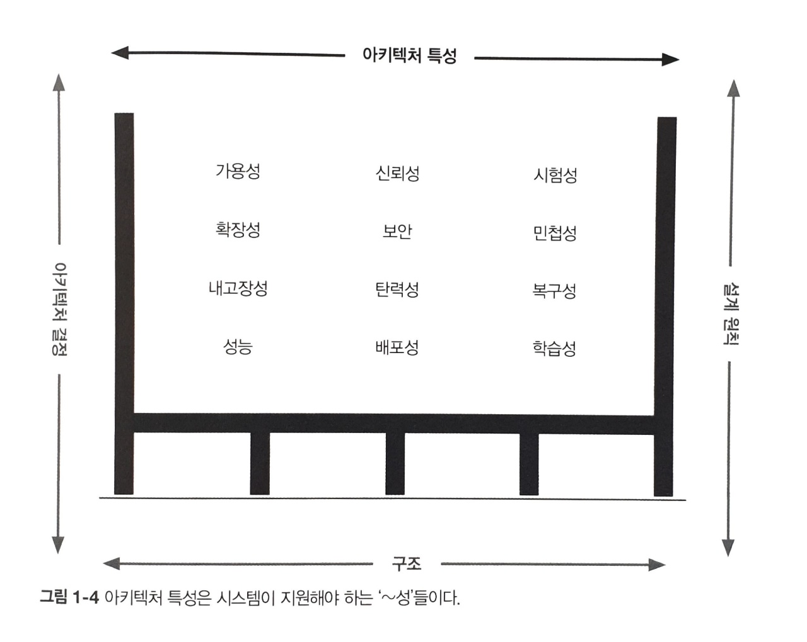
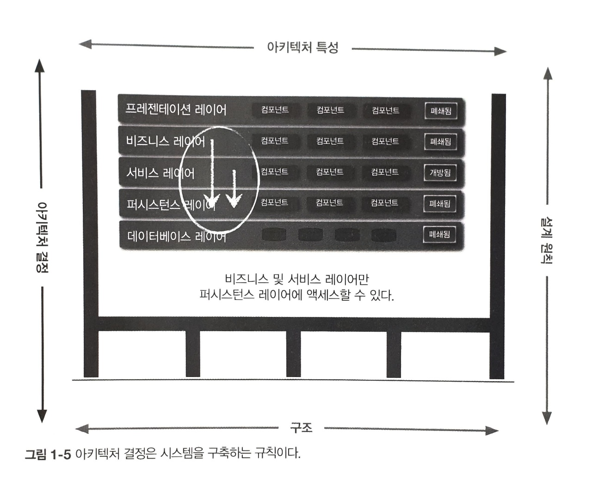
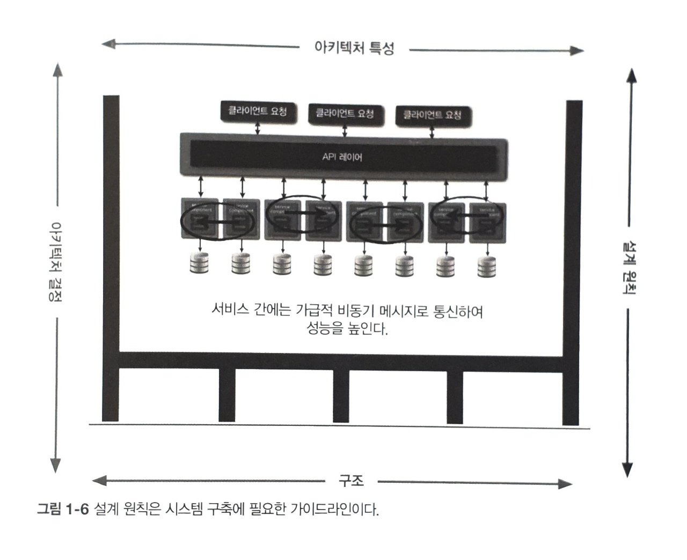
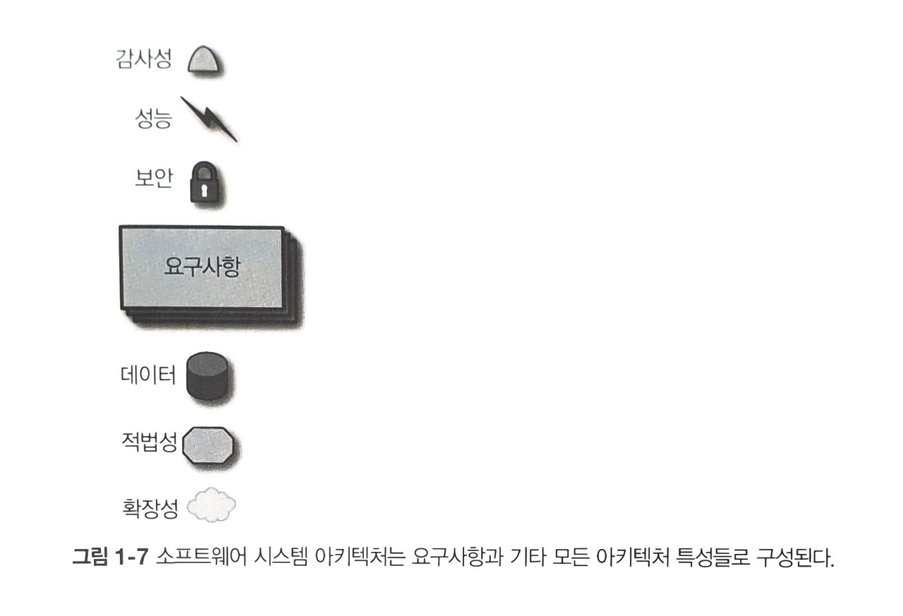

# Ch 1. 서론

10년 전만 해도 소프트웨어 아키텍트는 주로 모듈성(modularity), 컴포넌트(component), 패턴(pattern) 등 순수 기술적인 부분을 다루었지만, 이제는 (마이크로서비스처럼) 훨씬 폭 넓은 능력을 활용하는 새로운 아키텍처 스타일의 등장으로 인해 그 역할과 범위가 한층 더 확대되었다. p26

---

## 1.1 소프트웨어 아키텍처란?

**소프트웨어 아키텍트는 이렇게 끊임없이 변하는 생태계 안에서 뭔가 결정을 내리는 사람들이다.** 

아키텍처를 공부하는 사람들이 명심해야 할 점은, **아키텍처란 예술과 마찬가지로 콘텍스트(context, 문맥, 맥락)로서만 이해할 수 있다는 것이다.** 20세기의 아키텍처의 주요 목표 중 하나는 최대한 효율적으로 리소스를 공유하여 사용하는 것이었는데, 그 시절에는 운영 체제, 어플리케이션 서버, 데이터베이스 서버 등 모든 인프라의 가격이 비쌌기 때문에 당연했다. 이후 오픈 소스가 개발되고 데브옵스 혁명을 통해 지금은 얼마든지 모든 서비스가 자신만의 분리된 머신에서 실행될 수 있게 할 수 있다. p27

**아키텍처는 아키텍처 특성(architecture characteristic), 아키텍처 결정(architecture decision), 설계 원칙(design principle)이 결합된 구조다(structure).** 시스템의 구조란 시스템이 구현된 (마이크로서비스, 레이어드, 마이크로 커널 같은) 아키텍처 스타일(들)의 종류를 말한다. 시스템의 아키텍처를 완전히 이해하려면 아키텍처 특성, 아키텍처 결정, 설계 원칙도 알아야 한다. p28~29

---

---

아키텍처 특성은 소프트웨어 아키텍처를 다른 관점에서 바라본 것으로, 일반적으로 시스템의 기능과 직교하는(orthogonal) 시스템의 성공 기준(success criteria)을 결정한다. p30

---

---

아키텍처 결정은 시스템 구축에 필요한 규칙들을 정한 것이다. 가령, 아키텍트가 ‘레이어드(layered)’(계층화) 아키텍처에서는 프레젠테이션 레이어가 데이터베이스를 직접 호출하지 못하게 비즈니스와 서비스 레이어에서만 데이터베이스에 액세스 할 수 있다고 결정하는 식이다. 아키텍처 결정은 시스템의 제약조건(constraint)을 형성하며, 개발자가 해도 되는 것과 하지 말아야 할 것을 알려준다. p31

---

---

아키텍처 결정이 반드시 지켜야 할 규칙이라면 설계 원칙은 가이드라인(guideline)이다. 예를 들어 마이크로서비스 아키텍처의 성능 향상을 위해 서비스 간 통신은 비동기 메시징을 활용해야 한다고 기술하는 것이 설계 원칙이다. 서비스간 통신에 관한 모든 조건과 구현 방안을 아키텍처 결정(규칙)으로 다룰 수는 없기에 특정 환경에서 개발자가 더 적합한 (REST나 gRPC 같은) 통신 프로토콜을 선택할 수 있도록 우선 권장하는 방법에 관한 가이드를 설계 원칙으로 제공하는 것이다. p32

---

---

## 1.2 아키텍트에 대한 기대치

일반적으로 회사 그리고 팀에서 소프트웨어 아키텍트에게 기대하는 것들은 다음과 같은 것들이 있다. 너무 당연한 이야기들은 제외했다. p33~39

---

1. 아키텍트는 아키텍처와 설계 원칙을 결정하고 팀, 부서 뿐만 아니라 회사 전체의 기술 결정을 가이드하는 사람이다. 첫 번째 요구사항의 키워드는 ‘가이드’이다. 
    1. 아키텍트는 기술 선택을 가이드(guide)하는 사람이지 정해주는(specify) 사람이 아니다. 
    2. 이 일은 생각보다 어려우며, 효과적인 아키텍처 결정을 하려면 아키텍트 자신이 내린 결정이 개발팀 스스로 옳은 기술 결정을 하도록 가이드하는데 도움이 되는지, 아니면 개발팀을 위해 기술을 대신 선택해주는게 더 나을지 자문해 보아야 한다.

---

2. 아키텍트는 아키텍처 결정과 설계 원칙의 컴플라이언스를 보장해야 한다. 
    1. 컴플라이언스 보장이란, 아키텍트가 정의하고 문서화하여 전달한 아키텍처 결정과 설계 원칙들을 개발팀이 제대로 준수하고 있는지 지속적으로 확인한다는 뜻이다. 
    2. 가령, 프리젠테이션 레이어를 제외한 비즈니스 레이어와 서비스 레이어만 데이터베이스 액세스가 가능하도록 아키텍트가 결정했다면 프리젠테이션 레이어는 아무리 단순한 데이터베이스 호출이라도 반드시 모든 아키텍처를 거쳐야 통신이 가능하다. 
    3. 아키텍트가 이렇게 결정한 데에는 ‘변경을 다스리겠다’는 중요한 의도가 깔려 있다. 레이어를 각각 분리함으로써 프리젠테이션 레이어에게 영향을 미치지 않고 데이터베이스를 변경할 수 있는 틀을 만든 것이다.

---

3. 아키텍트는 어느 수준 이상의 비즈니스 도메인 전문가여야 한다.
    1. 비즈니스 도메인 지식이 없으면 비즈니스의 문제점, 목표, 요구사항을 이해하기 어렵고, 따라서 비즈니스 요구사항을 수용할 만한 효율적인 아키텍처를 설계하기 어렵다.

---

4. 아키텍트는 기업 내부의 정치적 분위기를 이해하고 적절하게 잘 처신할 줄 알아야 한다.
    1. 협상 기술은 정말 중요하고 또 중요하다.
    2. 가령, 개발자가 복잡한 코드의 총 순환 복잡도(cyclomatic complexity)를 줄이고자 전략 패턴(strategy pattern)을 구사하기로 결정했다고 한다면, 이걸 회사에서 과연 얼마나 신경쓸까? 몇몇 개발자들 이외에는 관심이 없을 것이다.
    3. 아키텍처가 내린 거의 모든 결정은 사람들의 반발에 부딪히기 마련이다. 아키텍처 결정을 실천하려면 당연히 시간과 비용이 들어야 하므로 제품 오너, 프로젝트 관리자, 비즈니스 이해 담당자들의 뭇매를 맞게 될 수 밖에 없다. 따라서 아키텍트는 회사에서 정치를 잘 하면서 대부분의 결정을 사람들이 수용하도록 기본적인 협상 기술을 발휘해야 한다.

---

## 1.3 아키텍처의 교차점 그리고...

엔지니어링 프랙티스(engineering practice)와 소프트웨어 개발 프로세스(process)는 구분해야 한다. 프로세스는 팀을 어떻게 구성하고 관리할지, 회의는 어떻게 하고 워크플로 조직은 어떻게 운영할지 등 사람을 조직하고 상호작용하는 총체적인 기법이다. 반면, 소프트웨어 엔지니어링 프랙티스는 프로세스와 무관하게 가시적이고 반복 가능한 혜택을 주는 실천론이다. (e.g. 지속적 통합, continuous integration, CI) p40~41

---

엔지니어링 프랙티스에 집중하는 것은 중요하다. p42

1. 소프트웨어 개발 분야는 보다 성숙한 다른 엔지니어링 체계에 있는 많은 특성들이 빠져 있다.
    1. 가령, 중요한 구조를 변경할 경우 토목 엔지니어는 소프트웨어 엔지니어보다 훨씬 더 정확하게 결과를 예측할 수 있다.
2. 소프트웨어 개발의 아킬레스건 중 하나는 추정(estimation)이다. 
    1. 알려지지 않은 미지의 것들(unknown unknowns) 때문에 더 어렵다.
    2. 아키텍트는 알려지지 않은 미지의 것들을 설계할 수 없기 때문에 ‘빅 디자인 업 프런트(Big Design Up Front, 일단 설계부터 확실하게)’ 방식으로 진행하기가 어렵다.

> 모든 아키텍처는 알려지지 않은 미지의 것들 때문에 자꾸 되풀이되는데, 애자일은 단지 이것을 인지해서 더 빨리 수행하는 것이다. - 마크 리처즈(이 책의 저자)
> 

---

소프트웨어 개발 세계에서 정적인 것은 하나도 없다. 아키텍트는 어떤 기준에 맞게 시스템을 설계할 수 있지만, 그 설계는 구현(아키텍트는 어떻게 자신이 설계한 대로 정확히 구현되도록 할까)과 소프트웨어 개발 생태계의 어쩔 수 없는 변화를 모두 거치면서 살아남아야 한다. 그래서 우리에게 필요한 것은 진화하는 아키텍처(evolutionary architecture)이다. p44

---

---

<Building Evolutionary Architecture>은 시간이 지나 변경이 일어나도 아키텍처 특성을 수호(protect) 그리고 관장(govern)하기 위해 진화 연산(evolutionary computing)에서 유래된 피트니스 함수라는 개념을 소개한다. 개발자는 유전 알고리즘을 설계할 때 솔루션을 변경하여 새로운 솔루션으로 계속 진화시키는 다양한 기법들을 가지고 있다. 이런 알고리즘을 특정한 용도로 설계할 때 개발자는 반드시 결과를 측정하여 최적해(optimal solution)에 가까워 졌는지, 멀어졌는지 확인해야 한다. 그 측정 수단이 피트니스 함수이다. p44

---

이 아이디어를 이용한 ‘아키텍처 피트니스 함수(architectural fitness function)’는 어떤 아키텍처 특성의 객관적인 완전성을 평가하는 수단이다. 메트릭(metric, 지표), 단위 테스트(unit test), 모니터(monitor), 카오스 엔지니어링(chaos engineering, 프로덕션 서비스의 각종 장애 조건을 견딜 수 있는 시스템의 신뢰성을 확보하기 위해 분산 시스템을 실험하고 배우는 분야) 등 다양한 메커니즘이 이 분야에 포함이 된다.

가령, 아키텍트는 페이지 로드 시간을 중요한 아키텍처 특성으로 꼽을 수가 있는데, 성능 저하 없이 시스템을 변경하려면 각 페이지마다 로드 시간을 측정하는 테스트로 피트니스 함수를 구축한 다음, 프로젝트를 위한 지속적 통합의 일환으로 이 테스트를 실행한다. 이렇게 하면 아키텍트는 피트니스 함수의 형태로 각 파트를 검증할 수 있는 메커니즘을 소유하게 되므로 아키텍처의 중요한 부분이 어떤 상태인지 항시 파악할 수 있다. p45

---

## 1.4 소프트웨어 아키텍처 법칙

소프트웨어 아키텍처 제 1법칙은 다음과 같다.

> 소프트웨어 아키텍처의 모든 것은 다 트레이드오프다.
> 

그 어느 것도 소프트웨어 아키텍트에게 깔끔하게 딱 떨어지는 것은 없다. 모든 결정은 여러 가지 상충되는 팩터들을 전부 다 고려해야 한다.

> 아키텍트가 트레이드오프가 아닌 뭔가를 발견했다고 생각했다면 그것은 그가 아직 트레이드오프를 발견하지 못했다는 증거일 가능성이 높다.
> 

우리는 원칙, 특성 등을 포함한 구조적 요소들을 초월한 용어로써 소프트웨어 아키텍처를 정의한다. 아키텍처는 이러한 구조적 요소들을 단순히 합쳐놓은 것보다 더 넓은 개념으로, 우리가 정리한 다음 소프트웨어 아키텍처 제2법칙에도 잘 반영되어 있다.

> ‘어떻게’보다 ‘왜’가 더 중요하다.
>