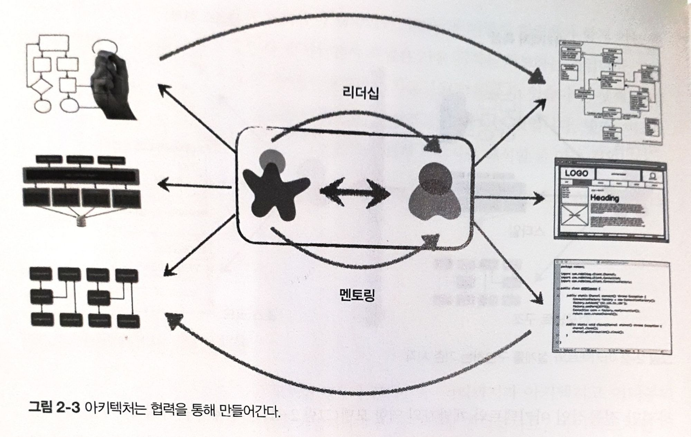

## 2장. 아키텍처 사고

아키텍처의 사고는 크게 네 가지로 나뉜다.

1. 아키텍처와 설계의 차이를 이해하고 아키텍처 작업을 진행하면 개발팀과 어떻게 협력해야 할지 아는 것
2. 어느 정도 기술의 깊이를 유지하면서 폭넓은 기술 지식을 확보하는 것
    1. 아키텍트는 다른 사람들이 보지 못하는 해결책과 가능성을 떠올릴 수 있다.
3. 다양한 솔루션과 기술 간의 트레이드오프를 이해하고, 분석하고 조율하는 것
4. 비즈니스 동인(business driver)의 중요성을 이해하고 그것을 아키텍처 관심사로 해석할 줄 아는 것

전통적인 아키텍트와 개발자의 관계

{width="800" height="300"}

이 전통적인 아키텍트와 개발자의 역할 모델은 문제가 많다. 아키텍트와 개발자를 나누는 가상의 물리적 장벽을 통과하는 단방향 화살표가 바로 아키텍처와 연관된 모든 문제의 원인이다. 아키텍트가 내린 결정이 개발팀에서 전혀 쓸모가 없는 경우가 있음에도 불구하고, 개발팀이 아키텍처를 변경하기로 결정한 내용이 다시 아키텍트에게 전달되는 일은 거의 없다.

제대로 된 아키텍처를 위해서는 반드시 **아키텍트와 개발자를 가르는 가상의 물리적 장벽을 허물고 두 팀이 양방향으로 소통하는 관계를 정립**해야 한다.

{width="800" height="300"}

### 기술 폭

기술 세부의 범위 또한 개발자와 아키텍트가 다르다.

업무를 진행하기 위한 기술 깊이(technical depth)를 확보해야 하는 개발자와 달리,
소프트웨어 아키텍트는 아키텍트답게 사고하고 아키텍처 시각을 유지하기 위해 상당한 기술 폭(technical breadth)을 갖춰야 한다.

세상의 모든 지식은 다음과 같이 세 가지 종류로 나누어져 있을 것이다.

- 내가 알고 있는 것
- 내가 모른다는 사실을 아는 것
- 내가 모른다는 사실조차 모르는 것

### 트레이드오프 분석

**아키텍트처럼 생각하는 것은 기술 여부와 상관없이 모든 솔루션의 트레이드 오프를 분석하여 최선의 솔루션을 결정하는 것**이다.

아키텍처는 구글링해도 안 되는 것이다 - 마크 (SW 아키텍처 101 저자)

아키텍처는 모든 게 다 트레이드 오프이다. 아키텍처를 문의하는 질문마다 “경우에 따라 다르다”라고 답할 때가 많은 것도 이 때문이다. 현실이 그렇다. REST와 메시징 중 어느 게 더 나은지, 마이크로서비스가 딱 맞는 아키텍처 스타일인지, 구글에서 찾아보아도 정답은 나오지 않는다. 경우에 따라서 다르기 때문이다. 배포 환경, 비즈니스 동인, 회사 문화, 예산, 기간, 개발자 스킬 세트 등 여러 팩터들이 영향을 미친다.

- 토픽의 장점
    - 아키텍처 신장성
    - 서비스 디커플링
- 토픽의 단점
    - 데이터 액세스 및 보안 문제
    - 서로 다른 계약 혼용 불가
    - 모니터링과 프로그래밍 방식의 확장성
