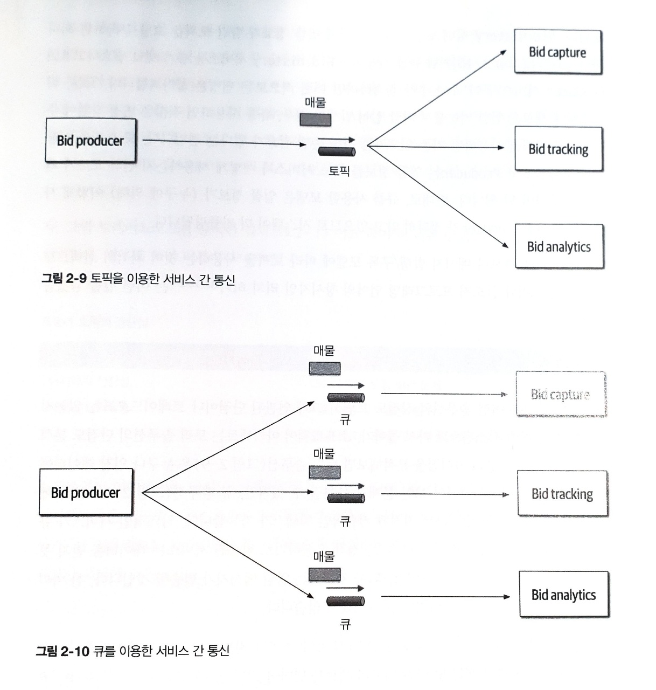

# Ch 2. 아키텍처 사고

아키텍처의 사고는 크게 네 가지로 나뉜다.

1. 아키텍처와 설계의 차이를 이해하고 아키텍처 작업을 진행하면 개발팀과 어떻게 협력해야 할지 아는 것
2. 어느 정도 기술의 깊이를 유지하면서 폭넓은 기술 지식을 확보하는 것
    1. 아키텍트는 다른 사람들이 보지 못하는 해결책과 가능성을 떠올릴 수 있다.
3. 다양한 솔루션과 기술 간의 트레이드오프를 이해하고, 분석하고 조율하는 것
4. 비즈니스 동인(business driver)의 중요성을 이해하고 그것을 아키텍처 관심사로 해석할 줄 아는 것

---

## 2.1 아키텍처 대 설계

아키텍트처럼 사고한다는 건 **비즈니스와 기술 문제를 해결하기 위해 아키텍처와 설계의 차이점을 알고 이 둘을 긴밀하게 통합한 솔루션을 모색하는 것**이다.

전통적인 아키텍트의 책임과 개발자의 책임은 다음과 같다.

---

이 전통적인 아키텍트와 개발자의 역할 모델은 문제가 많다. 아키텍트와 개발자를 나누는 가상의 물리적 장벽을 통과하는 단방향 화살표가 바로 아키텍처와 연관된 모든 문제의 원인이다. 아키텍트가 내린 결정이 개발팀에서 전혀 쓸모가 없는 경우가 있음에도 불구하고, 개발팀이 아키텍처를 변경하기로 결정한 내용이 다시 아키텍트에게 전달되는 일은 거의 없다.

제대로 된 아키텍처를 위해서는 반드시 **아키텍트와 개발자를 가르는 가상의 물리적 장벽을 허물고 두 팀이 양방향으로 소통하는 관계를 정립**해야 한다.

---

---

## 2.2 기술 폭

기술 세부의 범위 또한 개발자와 아키텍트가 다르다. 업무를 진행하기 위한 기술 깊이(technical depth)를 확보해야 하는 개발자와 달리, 소프트웨어 아키텍트는 아키텍트답게 사고하고 아키텍처 시각을 유지하기 위해 상당한 기술 폭(technical breadth)을 갖춰야 한다.

세상의 모든 지식은 다음과 같이 세 가지 종류로 나누어져 있을 것이다.

- 내가 알고 있는 것
- 내가 모른다는 사실을 아는 것
- 내가 모른다는 사실조차 모르는 것

---

`내가 알고 있는 것`은 자바 프로그래머가 자바를 아는 것처럼 전문 기술자가 일상 업무 수행에 사용하는 기술, 프레임워크, 언어, 도구를 말한다. `내가 모른다는 사실을 아는 것`은 전에 한 번 들어봤거나 얕은 지식은 갖고 있지만 실무 경험은 거의 전무한 기술을 가리킨다. (e.g 클로저라는 프로그래밍 언어) `내가 모른다는 사실조차 모르는 것`은 기술자가 해결하려는 문제에 완벽한 정답임에도 불구하고 그 존재조차 알지 못하는, 절대 다수의 기술, 도구, 프레임워크, 언어이다.

---

개발 초심자 시절에는 `내가 알고 있는 것`을 넓혀 경험과 전문성을 쌓는 데 주력한다. 그러다 보면 `내가 모른다는 사실을 아는 것`에 해당하는 영역도 점점 늘어난다. `내가 알고 있는 것`은 내가 계속 유지해야 할 것으로 소프트웨어 세계에서는 가만히 있지 않는다. 이 부분은 개발자가 시간을 들여 전문성을 유지해야 하는 부분이다.

---

아키텍트의 경우 이야기가 조금 달라진다. 아키텍트의 가치는 대부분 기술에 대한 폭넓은 이해와 그 기술을 사용해서 특정한 문제를 해결하는 것이다. 즉, 아키텍트는 어느 한 가지 문제만 해결 가능한 한 가지 전문지식보다는, 문제를 해결할 수 있는 다섯 가지 솔루션을 알고 있는게 더 중요하다. 따라서 아키텍트에게 가장 중요한 것은 `내가 모른다는 사실을 아는 것`이 영역의 너비와 깊이가 얼마나 넓은가, 따라서 `내가 모른다는 사실조차 모르는 것`을 어디까지 관통할 수 있는 것인가 이다. 아키텍트에게는 깊이보다 폭이 더 중요하다.

---

## 2.3 트레이드오프 분석

**아키텍트처럼 생각하는 것은 기술 여부와 상관없이 모든 솔루션의 트레이드 오프를 분석하여 최선의 솔루션을 결정하는 것**이다.

아키텍처는 구글링해도 안 되는 것이다 - 마크 (SW 아키텍처 101 저자)

아키텍처는 모든 게 다 트레이드 오프이다. 아키텍처를 문의하는 질문마다 “경우에 따라 다르다”라고 답할 때가 많은 것도 이 때문이다. 현실이 그렇다. REST와 메시징 중 어느 게 더 나은지, 마이크로서비스가 딱 맞는 아키텍처 스타일인지, 구글에서 찾아보아도 정답은 나오지 않는다. 경우에 따라서 다르기 때문이다. 배포 환경, 비즈니스 동인, 회사 문화, 예산, 기간, 개발자 스킬 세트 등 여러 팩터들이 영향을 미친다.

아키텍처가 어렵다는 말이 나오는 건, 저마다 다른 환경, 상황, 문제를 안고 있기 때문일 것이다.

아키텍처는 정답도, 오답도 없다. 오직 트레이드오프만 있을 뿐. - 닐 (SW 아키텍처 101 저자)

경매 참가자들이 원하는 물품에 입찰을 하는 경매 시스템을 예로 들어보자.

---

---

Bid Producer(입찰 프로듀서) 서비스는 입찰자(bidder)로부터 입찰을 생성하고, 입찰 금액을 Bid Capture(입찰 캡처), Bid Tracking(입찰 추적), Bid Analytics(입찰 분석) 서비스에 전달한다. 이 작업은 큐를 이용한 점대점 메시지 방식도 가능하고, 토픽을 사용한 메시지 발행/구독 방식으로도 구현할 수 있다. 둘 중에 어느 것을 사용해야 하는지 정답은 없다. 이는 구글링을 해 보아도 나오지 않는다.

---

---

토픽을 사용한다면 아키텍처 신장성(architecture extensibility)이 무엇보다 확실한 강점이다. 큐를 사용한다면 Bid Producer 서비스가 세 큐에 접속해야 하지만, 토픽을 사용하면 한 토픽에 한 번만 연결하면 된다. 나중에 입찰자가 스스로 입찰한 전체 기록을 조회할 수 있는 이력 서비스를 새로 도입하더라도 기존 경매 시스템은 전혀 고칠 필요가 없는 구조이다. Bid History 서비스가 신설되면 이미 입찰 정보가 담긴 토픽을 그냥 구독하면 된다. 그러나 큐를 사용하면 Bid History 서비스용 큐가 새로 필요하고 Bid Producer 서비스가 이 큐에 접속하려면 어떤 식으로든 변경이 불가피하다.

이 시스템에 새로운 입찰 기능을 추가할 일이 발생할 경우, 큐를 사용하면 적잖은 변경 작업이 수반되지만 토픽을 사용하면 기존 인프라를 전혀 손 댈 필요가 없다. 토픽을 사용한 모델에서 Bid Producer는 입찰 정보를 어느 서비스가 어떻게 사용하는지 전혀 모르기 때문에 커플링이 덜 된다. 반대로, 큐를 사용한 모델은 입찰 정보가 (누구에 의해) 어떻게 사용되는지 Bid Producer가 정확히 알고 있으므로 시스템이 더 커플링 된다. 

---

이렇게 보면 Sub/Pub 모델에 따라 토픽을 사용하는 것이 최적의 선택인 것처럼 보인다. 하지만 클로저 프로그래밍 언어의 창시자인 리치 하키는 다음과 같이 말했다.

> 프로그래머는 장점은 잘 알지만 트레이드 오프는 하나도 모른다. 아키텍트는 둘 다 잘 알아야 한다. - 리치 하키
> 

소프트웨어 아키텍트는 토픽 솔루션은 누구나 입찰 데이터에 액세스 할 수 있으므로 데이터 보안 문제가 불거질 수 있지만, 큐 솔루션은 큐에 전달된 데이터는 큐를 수신하는 지정된 컨슈머만 액세스가 가능하다. 악의적인 서비스가 큐를 리스닝해서 입찰 정보가 유출될 경우, 정작 수신하기로 약속된 서비스는 데이터를 받지 못해 데이터 유실을 경고하는 알림 메시지가 발생할 것이다. 정리하면 토픽은 도청하기가 쉽지만 큐는 그렇지 않다.

---

보안 문제뿐만 아니라, 토픽 솔루션은 한 가지 계약(constract)만 지원하므로 입찰 데이터를 수신한 서비스는 모두 동일한 계약 및 입찰 데이터 세트를 받아야 한다. 하지만 큐 솔루션은 각 컨슈머가 필요로 하는 데이터에 관한 자신만의 데이터 계약을 가질 수 있다. 

토픽 솔루션은 토픽의 메시지 갯수를 모니터링 할 수 없고 자동 확장(auto-scaling) 기능이 지원되지 않는 단점이 있다. 반면에 큐 솔루션은 각 큐를 따로 모니터링 할 수 있고 입찰 컨슈머 마다 개별적으로 로드 밸런싱(load balancing, 부하 분산) 로직을 적용할 수 있기 때문에 상호 독립적인 자동 확장이 가능하다. 이러한 트레이드오프는 AMQP(Advanced Message Queuing Protocol)의 구조상 (프로듀서가 메시지를 보내는) 익스체인지와 (컨슈머가 리스닝하는) 큐를 분리할 수 있으므로 프로그래밍 방식의 로드 밸런싱과 모니터링이 가능한 기술적인 특성과도 연관이 있다.

---

### 정리

- 토픽의 장점
    - 아키텍처 신장성
    - 서비스 디커플링
- 토픽의 단점
    - 데이터 액세스 및 보안 문제
    - 서로 다른 계약 혼용 불가
    - 모니터링과 프로그래밍 방식의 확장성