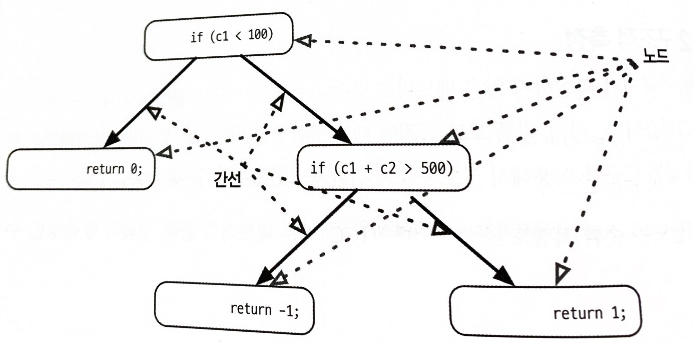

## **6.1 아키텍처 특성 측정**

아키텍처 특성을 정의할 때에는 흔히 다음과 같은 문제들이 발생한다.

### **물리학이 아니다**

아키텍처 특성은 대부분 의미가 모호하다. 동일한 용어도 업계에서 바라보는 시각이 제각각이고 법적인 상황에 따라 좌지우지되거나 우발적으로 의미가 정해지는 경우도 있다.

### **정의가 너무 다양하다**

성능 같은 중요한 특성에 대한 정의가 같은 조직에서도 부서마다 일치하지 않아 개발자, 아키텍트, 운영자 모두 정의를 통일하기 전까지는 원활하게 소통하기가 어렵다.

### **너무 복합적이다**

바람직한 아키텍처 특성은 대부분 더 작은 여러 특성들로 구성된다. 예를 들어, 개발자는 민첩성을 모듈성, 배포성, 시험성 등의 특성으로 세분화할 수 있다.

이 세 가지 문제는 아키텍처 특성을 객관적으로 정의하면 모두 해결된다. 아키텍처 특성을 명확하게 정의하고 조직 전체가 이에 동의하면 팀은 공통의 아키텍처 언어를 확립할 수 있다. 또 복합적인 특성은 더 잘게 나누어 분석해보면 객관적으로 정의할 수 있는, 측정 가능한 특성을 밝혀낼 수 있다.

### **6.1.1 운영적 측정**

아키텍처 특성은 성능, 확장성처럼 비교적 정확하게 측정할 수 있는 것도 많지만, 팀 목표에 따라 그에 따른 해석은 미묘하게 갈릴 때가 많습니다. 예를 들어, 특정 요청에 대한 평균 응답 시간을 측정할 경우, 어떤 경계 조건 때문에 1%의 요청이 다른 요청보다 처리 시간이 10배나 오래 걸리면 어떻게 해야 할까요? 사내 네트워크 리소스가 충분하다면 특이점은 나타나지 않을 수 있으니 최대 응답 시간도 함께 측정해야 특이점까지 잡아낼 수 있을 것이다.

**`수준 높은 팀은 달성하기 어려운 성능 수치를 정하는 대신, 통계 분석 결과로 얻은 나름대로의 정의에 기반한다`.** 예를 들어, 확장성을 모니터링하는 비디오 스트리밍 서비스 업체가 있다고 하자. 엔지니어는 시간에 따라 어떤 추이를 보이는지 측정하고 통계 모델을 수립한다. 그리고 실시간 수집한 메트릭이 예측 모델에서 벗어난 경우에 알림 메시지를 보낸다. 만약, 이 과정이 수포로 돌아간다면 원인은 모델 자체가 부정확했거나, 뭔가가 잘못되었거나 두 가지 중 하나일 것이다.

도구가 발전하고 이해도가 높아지면서 팀이 특정할 수 있는 아키텍처 특성은 빠르게 진화하고 있다. 예를 들어, 요즘은 최초 콘텐츠 렌더링(First Contentful Paint)와 최초 CPU 유휴(First CPU idle) 같은 메트릭에 성능 예산을 집중해서 **모바일 기기로 접속한 유저의 성능 문제를 비중 있게 다루는 경우도 많다**. 기기, 목표, 능력, 기타 다른 많은 것들이 변할수록 팀은 새로운 것을 발견하고 그것을 측정할 새로운 방법을 찾게 될 것이다.

### **6.1.2 구조적 측정**

`성능처럼 목표치가 확실하지 않은 메트릭도 있다. 잘 정의된 모듈성처럼 내부 구조에 관한 특성도 그렇다`. 아직 내부 코드 품질에 대한 종합적인 메트릭은 없지만, 아키텍트는 다른 메트릭과 공통 도구를 이용해서 코드 구조에 관한 중요한 부분들을 들여다볼 수 있다.

**코드의 복잡도는 순환 복잡도(cyclomatic complexity, CC)라는 메트릭을 통해 명쾌하게 측정할 수 있다.** 

> `순환 복잡도`
> 
> 
> 함수/메서드, 클래스, 또는 애플리케이션 레벨에서 코드 복잡도를 객관적으로 나타내는 지표입니다. 
> 
> CC는 코드에 그래프 이론을 적용하여 계산한다. 
> 

```java
// 순환 복잡도를 계산하는 코드
 
 public void decision(int c1, int c2) {
   if (c1 < 100)
     return 0;
   else if (c1 + c2 > 500)
     return -1;
   else
     return 1;
 }
```

위 코드의 순환 복잡도를 구하면 `5 - 4 + 2 = 3`이다. (아래그림)



### **6.1.3 프로세스 측정**

`소프트웨어 개발 프로세스와 교차하는 아키텍처 특성도 있다`. 예를 들어, 민첩성은 바람직한 특성으로 보일 때가 많은데, 이는 시험성, 배포성 등의 특성으로 나눌 수 있는 복합적인 아키텍처 특성이다. 

**`시험성은 거의 모든 플랫폼에서 테스트의 완전성을 평가하는 코드 커버리지 도구로 측정할 수 있다`**. 물론, 소프트웨어 체크가 다 그렇듯이 시험성도 사고(thinking)와 의도(intent)를 대체할 수는 없다. 그러나 어쨌든 시험성은 분명히 객관적으로 측정할 수 있는 특성이다. 마찬가지로, **`배포성 역시 실패 대비 배포 성공률, 배포 소요 시간, 배포 시 발생한 이슈/버그 등 다양한 메트릭으로 측정된다`**. 

양과 질 모든 면에서 조직에 유용한 데이터를 포착할 수 있는 측정 세트는 각 팀별로 알아서 준비해야 한다. 또 이렇게 측정한 메트릭들은 실제로 대부분 팀의 우선순위, 목표가 된다. 

## **6.2 거버넌스와 피트니스 함수**

### **6.2.1 아키텍처 특성 관리**

거버넌스(governance)는 kubernan(이끌다, streer)라는 그리스어에서 유래된 말이다. **거버넌스는 아키텍트가 담당하는 중요한 업무이다**. 아키텍처 거버넌스는 이름에서도 느껴지지만 아키텍트가 영향력을 행사하려는 모든 소프트웨어 개발 프로세스를 포괄한다.

### **6.2.2 피트니스 함수**

개발자가 알고리즘을 설계하여 유익한 결과를 얻으려면 **결과의 품질을 객관적으로 측정하면서 이 알고리즘을 통제할 수 있어야 한다**.

결과가 목표에 얼마나 근접했는지를 나타내는 목표 함수가 바로 피트니스 함수이다.

> 피트니스 함수 예시?
> 

### **아키텍처 피트니스 함수**

**어떤 아키텍처 특성(또는 그런 특성들의 조합)의 객관적인 무결성을 평가하는 모든 메커니즘**

아키텍처 특성을 검증하는 기법은 그 특성만큼이나 다양하다. 피트니스 함수는 사용하는 방법에 따라 메트릭, 모니터, 단위 테스트 라이브러리, 카오스 엔지니어링 등 기존의 많은 검증 메커니즘과 중첩되는 부분이 있다.

### **순환 의존성**

**모듈성은 대부분의 아키텍트가 관심을 기울이는 암묵적인 아키텍처 특성이다**. 모듈성이 제대로 유지되지 못하면 코드베이스 구조에 해를 끼치므로 우선 순위를 높게 두어 관리할 수 밖에 없다. 하지만 아키텍트가 좋은 의도를 갖고 있더라도 많은 플랫폼에서 그에 반하는 어쩔 수 없는 일들이 벌어진다.

**아키텍트는 JDepend라는 메트릭 도구로 패키지간 의존성을 체크한다.** 이 도구는 자바 패키지 구조를 알고 있고 순환 참조가 하나라도 존재하면 테스트는 실패한다. 아키텍트는 이 테스트를 프로젝트의 지속적 빌드의 일부로 장치함으로써 `개발자 때문에 순환 참조가 발생하지 않을까` 하는 염려를 덜 수 있다. 이는 소프트웨어 개발에서 신속한 진행보다 중요한 것을 수호하는 피트니스 함수의 좋은 사례이다.

> 아키텍트는 개발자에게 피트니스 함수 사용을 권하기 전에 그들이 정확한 목적을 이해할 수 있도록 충분히 설명해야 한다.
> 

**간결한 체크리스트는 효과적으로 기억을 되살려주는 역할을 한다. 피트니스 함수도 마찬가지이다.**

**피트니스 함수는 무거운 거버넌스 메커니즘보다는 아키텍트가 중요한 아키텍처 원칙을 표현하고 자동으로 검증할 수 있는 메커니즘을 제공한다**. 안전하지 않은 코드를 릴리즈하면 안 된다는 것쯤은 개발자도 알고 있지만, 개발 일정의 압박에 시달리다 보면 다른 수십, 수백 가지와 우선순위 경합이 벌어질 것이다. 아키텍트가 넷플릭스의 보안 멍키 같은 구체적인 도구와 피트니스 함수 같은 일반적인 도구를 잘 활용하면 중요한 거버넌스 체크를 아키텍처 하부에 구체화할 수 있다.