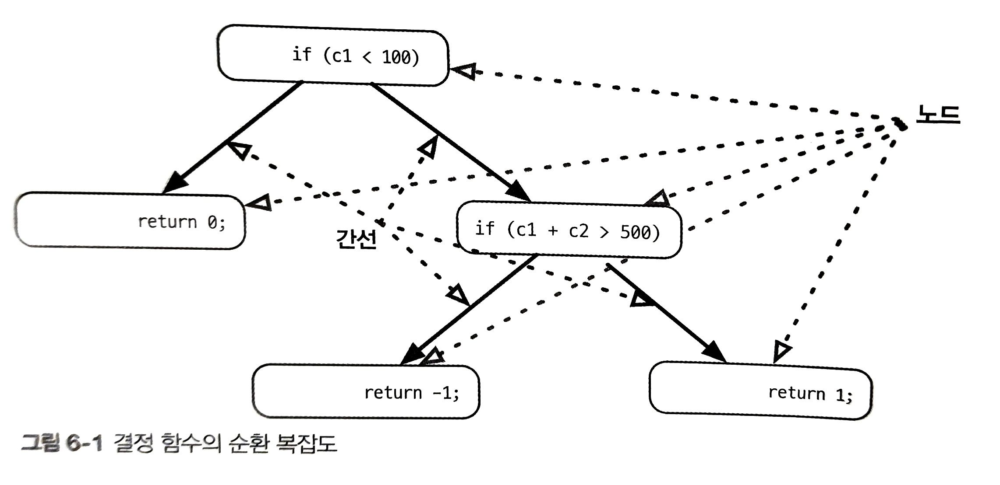
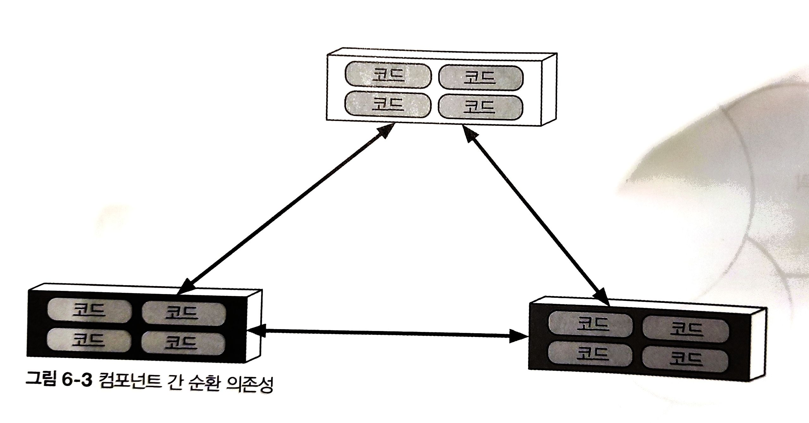
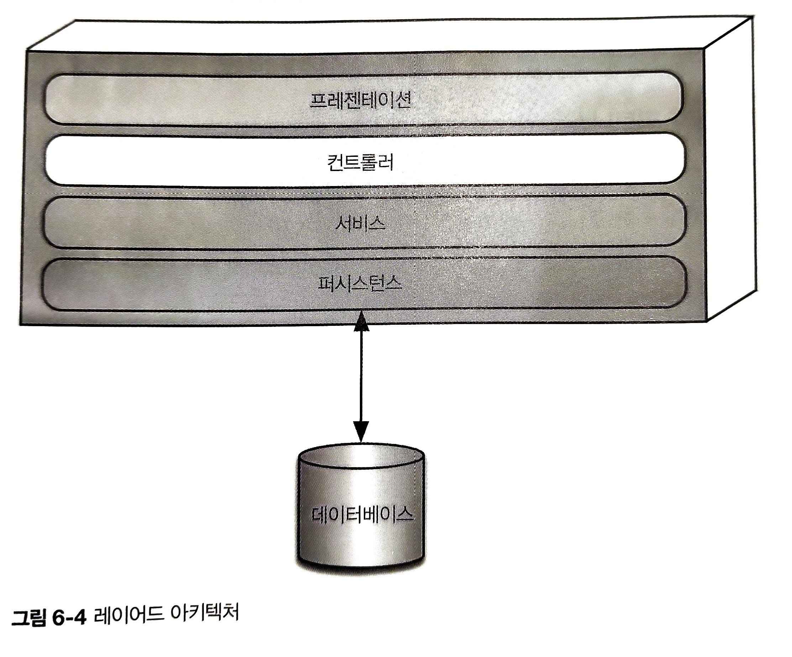

# Ch06. 아키텍처 특성의 측정 및 거버넌스

---

## 6.1 아키텍처 특성 측정

아키텍처 특성을 정의할 때 발생하는 문제

1. 물리학이 아니다.
2. 정의가 너무 다양하다.
3. 너무 복합적이다.

이러한 특성은 아키텍처의 특성을 객관적으로 정의하면 모두 해결이 된다.

---

### 6.1.1 운영적 특성

수준 높은 팀은 달성하기 어려운 성능 수치를 정하는 대신, 통계 분석 결과로 얻은 나름대로의 정의에 기반

e.g. 비디오 스트리밍 서비스 업체
- 시계열에 따른 추이 확인 후 통계 모델 수립
- 수집한 메트릭이 예측 모델에서 벗어난 경우 알림 받음
- 과정 실패?
    - 모델 자체가 부정확(팀이 알고 싶어하는 것)
    - 뭔가가 잘못(역시 팀이 알고 싶어하는 것)

팀이 측정할 수 있는 아키텍처 특성은 빠르게 진화
- 최초 콘텐츠 렌더링(First Contentful Paint, FCP)
- 최초 CPU 유휴(First CPU idle)

---

### 6.1.2 구조적 특성

목표치가 확실하지 않은 메트릭도 있음(e.g 성능, 잘 정의된 모듈성)
내부 코드 품질에 대하여도 메트릭과 공통 도구를 이용해 코드 구조를 들여다 볼 수 있다.

---

순환복잡도(Cyclomatic Complexity)

- 1976년 토마스 맥케이브(Thomas McCabe)가 개발한 코드 레벨의 메트릭
- 함수/메서드, 클래스, 또는 애플리케이션 레벨에서 코드 복잡도를 객관적으로 나타내는 지표
- 코드에 그래프 이론을 적용하여 계산
    - 상이한 실행 경로(execution path)를 유발하는 결정점(decision point)을 이용
    - e.g 어떤 함수에 (if문 같은) 결정문이 하나도 없다면 CC = 1
    - 조건 분기가 하나가 있으면 CC = 2

하나의 함수나 메서드에서 CC를 구하는 공식은 **CC = E - N + 2P**
N은 노드(코드 라인), E는 간선(가능한 결정), P는 연결된 컴포넌트 수

---

예제

```c
public void decision(int c1, int c2) {
    if(c1 < 100) 
        return 0;
    else if(c1 + c2 > 500)
        return -1;
    else
        return 1;
}
```

이 코드의 CC(순환 복잡도)는 얼마일까?

---



N = 5, E = 4, P = 1
**CC = 5 - 4 + 2*1 = 3**  

---

CC는 얼마가 적당할까?

- 모든 답이 그렇듯, 경우에 따라 다르다.
- 함수가 복잡한 이유?
    - 문제 영역 때문인가?(애초에 복잡한 함수가 많이 등장하는 복잡한 문제)
    - 코딩 품질이 낮아서 그런건가?
    - 코드 분할이 제대로 안 되어서 그런 건가?
- 도메인을 고려하지 않고 보면, 업계에서는 CC 10 이하를 권장
    - 저자는 이 기준도 너무 높고 5 이하로 나와야 응집도가 괜찮다고 생각함
- JAVA는 [crap4j](http://www.crap4j.org/) 라는 도구로 CC와 코드 커버리지를 측정할 수 있음

---

### 6.1.3 프로세스 측정

민첩성은 시험성, 배포성 등 여러 특성으로 나눌 수 있는 복합적인 특성

시험성
- 코드 커버리지로 평가 가능
- 사고(thinking)와 의도(intent)를 대체할 순 없다.
    - e.g. 커버리지 100% 이지만 어설션(assertion, 개발 모드에서만 컴파일되는 코드)이 형편없을 수 있음

배포성
- 배포 성공률
- 배포 소요시간
- 배포 발생 시 이슈/버그

*나누고 싶은 질문 : 회사에서 코드 커버리지, 배포 관련 메트릭은 어떻게 보고 계시나요?*

---

## 6.2 거버넌스와 피트니스 함수

모듈성은 아키텍처 관점에서는 중요하나, 긴급하진 않다.
긴급성(urgency)을 무시할 수는 없지만, 아키텍트는 거버넌스 메커니즘을 강구해야 한다.

### 6.2.1 아키텍처 특성 관리

거버넌스(governance) : 아키텍트가 영향력을 행사하려는 모든 소프트웨어 개발 프로세스를 포괄
아키텍처 거버넌스의 여러 부분을 자동화 할 수 있고, 그 중 한가지인 피트니스 함수 기법을 소개

---

### 6.2.2 피트니스 함수

개발자가 유전자 알고리즘을 설계하여 유익한 결과를 얻으려면, 결과의 품질을 객관적으로 측정하면서 알고리즘 통제 할 수 있어야 함
이처럼 결과가 목표에 얼마나 근접했는지 나타내는 목표 함수가 피트니스 함수

e.g. 외판원 문제(https://en.wikipedia.org/wiki/Travelling_salesman_problem)

- 한 외판원이 방문해야 할 도시 목록과 도시 간 거리가 주어질 경우, 최적의 이동경로를 찾는 문제
- 이 문제를 풀 때 피트니스 함수는 여러 가지가 될 수 있음
    - 그냥 이동 경로 거리를 계산해서 그 거리가 가장 짧은 최적을 표시
    - 이동 경로에 발생하는 전체 비용을 최소화
    - 외판원이 떠난 시간을 계산해 전체 여행시간을 줄이는 방법 최적화 

아키텍처 피트니스 함수 : 어떤 아키텍처 특성의 객관적인 무결성을 평가하는 모든 메커니즘

---

순환 의존성



이런 의존관계가 많아지면 개발자가 어느 한 컴포넌트를 재사용하기 위해 그에 딸린 다른 컴포넌트들도 함께 가져와야 하므로 모듈성이 떨어진다.

컴포넌트 간 커플링이 증가할수록 아키텍처는 점점 안티패턴

---

해결할 수 있는 방법 : 피트니스 함수로 순환 참조 여부를 발견하기

```java
public class CycleTest {
    private JDepend jdepend;

    @BeforeEach
    void init() {
        jdepend = new JDepend();
        jdepend.addDirectory("/path/to/...")
        // ...
    }

    @Test
    void testAllPackages() {
        Collection packages = jdepend.analyze();
        assertEquals("Cycle Exist", false, jdepend.containsCycles());
    }
}
```
JDepend 라는 메트릭 도구를 사용하여 패키지 간 의존성을 체크 
자바 패키지 구조를 알고 있어서 순환 참조가 하나라도 존재하면 테스트 실패

---



---

레이어드 아키텍처

구현하는 사람들이 이걸 과연 다 잘 지킬까?

- 패턴의 중요성을 모를 수도 있고
- '허락을 받느니 차라리 용서를 구하는게 낫다' 마인드 일 수도

ArchUnit 피트니스 함수로 레이어 의존성을 확인
```java
layeredArchitecture()
    .layer("Controller").definedBy("..controller..")
    .layer("Service").definedBy("..service..")
    .layer("Persistence").definedBy("..persistence..")

    .whereLayer("Controller").mayNotBeAccessedByAnyLayer()
    .whereLayer("Service").mayOnlyBeAccessedByLayers("Controller")
    .whereLayer("Persistence").mayOnlyBeAccessedByLayers("Service")
```

---

넷플릭스의 카오스 멍키(Chaos Monkey), 시미안 아미(Simian Army)도 피트니스 함수의 응용 사례

적합성 멍키, 보안 멍키, 문지기 멍키

- 모든 서비스가 모든 REST 동사에 유효한 응답을 해야 한다고 결정했다면, 적합성 멍키에 해당 체크 로직 구축
- 보안 멍키는 열려있으면 안 되는 포트가 있거나, 각종 설정 오류 등 서비스에 잘 알려진 보안 취약점은 없는지 체크
- 문지기 멍키는 더 이상 다른 서비스에서 트래픽이 들어오지 않는 서비스 인스턴스를 찾음