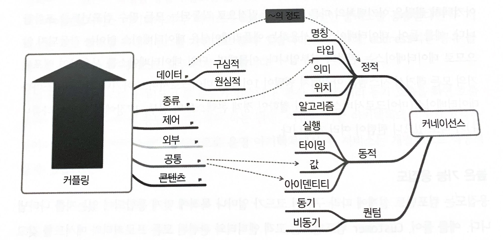

# 챕터 7. 아키텍처 특성 범위

아키텍트는 **운영 아키텍처 특성을 따져보고 아키텍처 특성에 영향을 미치는 코드베이스 외부의 컴포넌트를 잘 살펴봐야 한다**. 이런 종류의 의존성을 측정하기 위해 `Building Evolutionary Architecture`의 저자들은 `아키텍처 퀀텀(architecture quantum)`이라는 용어를 정의했다.

아키텍처 퀀텀의 의미를 이해하려면 먼저 커네이선스라는 핵심 메트릭을 잘 알아두어야 한다.

## **7.1 커플링과 커네이선스**

### **커네이선스**

두 컴포넌트 중 한쪽이 변경될 경우 다른 쪽도 변경해야 전체 시스템의 정합성이 맞는다면 이들은 커네이선스를 갖고 있는 것이다. 

밀러 페이지 존스는 **커네이선스를 정적 코드 분석으로 발견할 수 있는 `정적 커네이선스`와 런타임 동작에 관한 `동적 커네이선스`로 분류했다**. 아키텍처 퀀텀을 정의하려면 컴포넌트가 어떻게 서로 연결되어 있는지 측정할 방법이 필요한데, 이것이 바로 커네이선스라는 개념이다. 예를 들어, 마이크로서비스 아키텍처의 두 서비스가 address라는 동일한 클래스를 공유한다면 두 서비스는 서로 정적인 커네이선스를 가진다고 볼 수 있다. 다시 말해, address라는 공유 클래스를 변경하면 두 서비스도 모두 변경해야 한다. 

동적 커네이선스는 동기, 비동기 두 종류가 있다. 분산 서비스끼리 동기 호출을 하면 호출부는 피호출부의 응답을 기다려야 하는 반면, 이벤트 기반 아키텍처의 비동기 호출은 파이어 앤드 포겟 방식이므로 운영 아키텍처에서 두 서비스는 개별적으로 작동시킬 수 있다. 

## **7.2 아키텍처 퀀텀과 세분도**

소프트웨어를 서로 엮는 것은 컴포넌트 레벨의 커플링만이 아니다. 많은 비지니스 개념이 의미상 여러 시스템 파트를 한데 엮어 기능적으로 응집되어 있다. 성공적으로 소프트웨어를 설계, 분석, 발전시키기 위해 개발자는 문제가 될 만한 커플링 지점을 모두 살펴봐야 한다. 

**퀀텀은 상호작용을 하는 모든 물리 입자 가운데 가장 작은 양으로, 원어는 얼마나 많은(how many), 얼만큼의(how many)라는 뜻을 가진 라틴어 퀀텀(quantum)에서 유래한다. 이와 같은 개념에서 아키텍처 퀀텀을 도입했다.** 

### **아키텍처 퀀텀**

**높은 기능 응집도(high functional cohesion)와 동기적 커네이선스를 가진, 독립적으로 배포 가능한 아티팩트**

위의 문장에는 아래와 같은 개념들이 담겨 있다.

### **독립적으로 배포 가능**

아키텍처 퀀텀은 아키텍처의 다른 파트와 독립적으로 작동하는 모든 필수 컴포넌트를 포함한다. 예를 들어, 데이터베이스를 사용하는 애플리케이션은 데이터베이스 없이는 작동되지 않으므로 데이터베이스는 퀀텀의 일부이다. 이를테면, 단일 데이터베이스를 사용하여 배포된 거의 모든 레거시 시스템은 아키텍처 퀀텀이 1이지만, 마이크로서비스 아키텍처는 서비스마다 데이터베이스가 따로 있으니 퀀텀이 여러 개이다.

### **높은 기능 응집도**

응집도는 컴포넌트 설계에 따라 구현된 코드가 얼마나 목적에 맞게 통합되어 있는지를 나타낸다. 예를 들어, Customer 컴포넌트는 고객 엔티티와 관련된 모든 프로퍼티와 메서드를 갖고 있으므로 응집도가 높지만, Utility 컴포넌트는 여러 가지 잡다한 메서드를 무작위로 섞어놓아서 응집도가 낮은 편이다.

`기능 응집도가 높다는 건 아키텍처 퀀텀이 목적에 맞는 뭔가를 하고 있다는 뜻`이다. 단일 데이터베이스를 사용하는 모놀리식 애플리케이션에서는 이런 구분이 별로 의미가 없지만, 마이크로서비스 아키텍처는 보통 개발자가 각 서비스를 하나의 워크플로에 맞게 설계하므로 기능 응집도가 높게 나타난다.

### **동기적 커네이선스**

`동기적 커네이선스는 아키텍처 퀀텀을 형성하는 애플리케이션 콘텍스트 내부 또는 분산 서비스 간의 동기 호출을 의미한다`. 예를 들어, 마이크로서비스 아키텍처에서 어떤 서비스가 다른 서비스를 동기 호출할 때, 운영 아키텍처 특성 측면에서 두 서비스는 두드러진 차이를 나타낼 수 없다. 호출부가 피호출부보다 확장성이 훨씬 좋다면 타임아웃과 여타 신뢰성 문제가 일어날 것이다.

따라서, 동기 호출은 호출의 길이에 대해 동적 커네이선스를 만들어낸다. 즉, 한쪽이 다른쪽을 기다린다면 호출하는 도중에는 양쪽의 운영 아키텍처 특성이 동일해야 한다.

전통적인 커플링 메트릭과 커네이선스 간의 관계에 통신 커네이선스(communication connascence)라는 새로운 척도까지 추가된 그림이다.

> **도메인 주도 설계의 경계 콘텍스트**

DDD는 경계 콘텍스트(bounded context)라는 개념을 정의하는데, 도메인에 관한 모든 것이 내부에서는 보이지만 외부의 다른 경계 콘텍스트에서는 보이지 않는다. DDD 이전에는 사내 공통 엔티티를 개발자가 아무렇거나 가져가서 재사용했는데, 이렇게 아티팩트를 함께 쓰다 보니 커플링이 심해져 팀간 조율이 힘들고 복잡도가 증가하는 등 여러모로 문제가 많았다. 각 엔티티는 로컬 콘텍스트 내부에서 가장 잘 동작하므로 조직 전체가 함꼐 쓰는 통합 Customer 클래스를 만드는 대신, 각 문제 도메인에 자체 클래스를 두고 차이점은 그것을 통합하는 지점에서 조정하는 것이 경계 콘텍스트 개념이다. 코드 레벨의 메트릭이다. 순환 복잡도(CC)는 1976년 토마스 맥케이브가 개발한 코드 레벨의 메트릭이다.
> 

**`아키텍처 퀀텀 개념은 아키텍처 특성의 새로운 범위를 제시한다`. 현대 시스템에서 아키텍트는 시스템 레벨보다는 퀀텀 레벨의 아키텍처 특성을 정의한다.** 중요한 운영 관심사에 대해 범위를 좁혀보면 중요한 아키텍처 문제를 조기에 발견하여 하이브리드 아키텍처를 설계할 수도 있다.