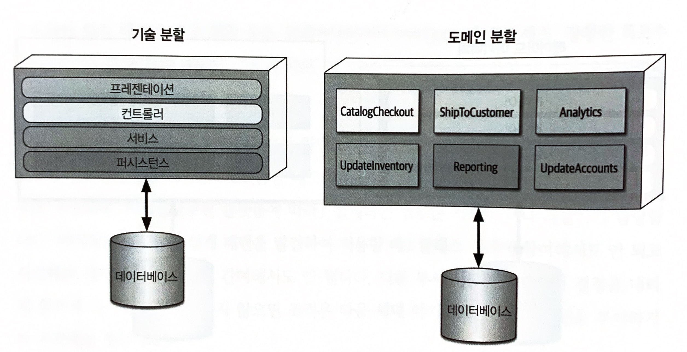
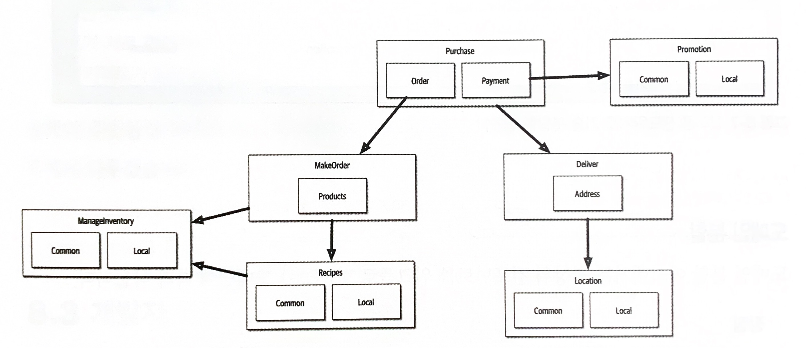
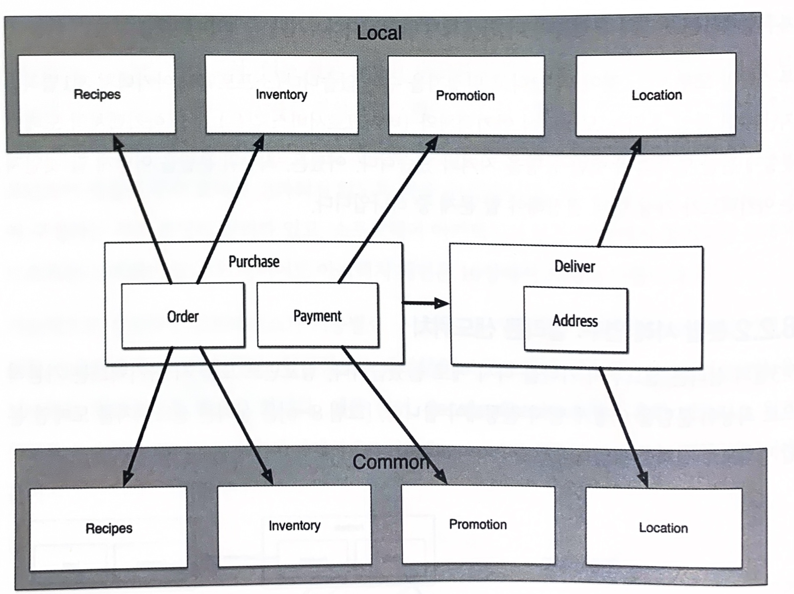
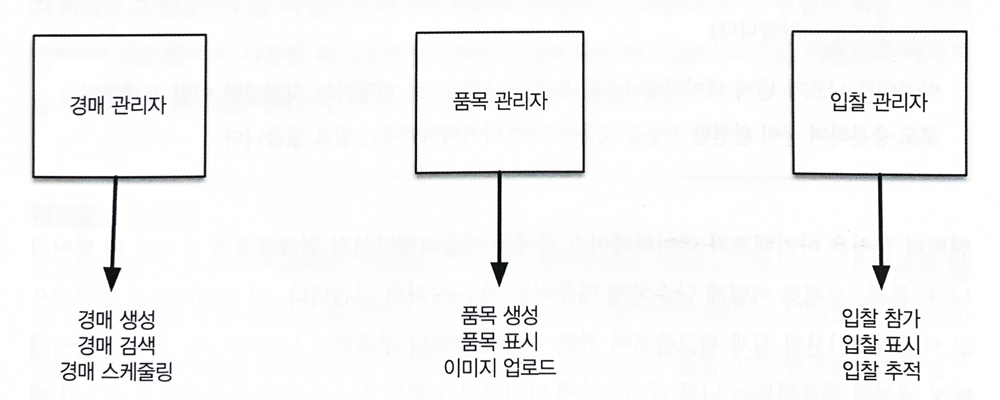

## 8.1 컴포넌트 범위

개발자는 컴포넌트 개념을 다양한 팩터에 세분화하는 것이 유용하다고 생각한다.

컴포넌트는 아티팩트를 한데 묶어 필요시 중첩시켜 계층화하는, 언어에 특정한 메커니즘을 제공한다. 가장 단순한 컴포넌트는 클래스(또는 비객체 지향 언어의 함수) 보다 한 단계 높은 수준의 모듈로 코드를 래핑한 것이다. 이 단순한 래퍼를 보통 라이브러리라고 한다.

컴포넌트는 아키텍처에서 서브시스템이나 레이어 형태로도 나타나며, 많은 이벤트 프로세서를 위한 배포 가능한 작업 단위이다. 서비스는 또 다른 종류의 컴포넌트로서 자신의 주소 공간에서 실행되며, TCP/IP 같은 저수준 네트워크 프로토콜이나 REST, 메시지 큐 같은 고수준 포맷을 통해 통신한다.

컴포넌트는 아키텍처의 근본적인 모듈성을 구성하는 요소로서 아키텍트에게 아주 중요한 고려사항이다. 실제로 아키텍트가 결정하는 중요한 항목 중 하나가 아키텍처 컴포넌트의 취상위 분할과 연관되어 있다.

## 8.2 아키텍트 역할

소프트웨어 아키텍트는 아키텍처 특성과 소프트웨어 시스템의 요구사항을 종합하여 비즈니스 분석가, 분야별 전문가, 개발자, QA 엔지니어, 운영자, 엔터프라이즈 아키텍트와 함께 소프트웨어 초기 설계를 한다.

소프트웨어 아키텍처는 일반적으로 개발 프로세스와 분리되어 있기 때문에 정규 결합 응용 설계 프로세스, 장황한 폭포수형 분석/설계, 애자일 스토리 카드 등 요구사항의 출처에 대해서는 관심이 없다.

일반적으로 컴포넌트는 아키텍트가 직접 맞닥뜨리는 최하위 소프트웨어 시스템이지만, 전체 코드베이스에 영향을 미치는 코드 품질 메트릭은 예외이다. 컴포넌트는 클래스나 함수로 구성되며, 이들을 설계하는 업무는 기술 리더나 개발자가 담당한다. 아키텍트는 클래스 설계에 참여해서도 안 되고 시스템의 세세한 설꼐 결정에 간여해서도 안 된다.

### 8.2.1 아키텍처 분할

컴포넌트는 일반적인 적재 메커니즘을 의미하므로 아키텍트는 재량껏 어떤 유형의 분할도 할 수 있다. 여기서는 최상위 분할(top-level partitioning)이라는 스타일을 설명할 것이다.

레이어드 아키텍처는 익숙한 형태일 것이다. 모듈러 모놀리스는 사이먼 브라운이 널리 보급한 아키텍처 스타일로서, 기술적인 능력이 아닌 도메인에 따라 분할된 단일 배포 단위이다. 최상위 분할은 근본적인 아키텍처 스타일과 코드 분할 방법을 결정짓기 때문에 아키텍트에게는 특별한 관심사이다. 기술적 최상위 분할은 레이어드 아키텍처와 같이 기술적인 능력에 따라 아키텍처를 구성하는 것이다.

위의 그림에서 아키텍트는 시스템의 기능을 기술적인 능력, 즉 프레젠테이션, 비지니스 규칙, 서비스, 퍼시스턴스 등으로 분할했다. 이렇게 코드를 구성하면 여러 면에서 합리적이다. 우선, 모든 퍼시스턴스 코드가 어느 한 레이어에 있으면 개발자가 퍼시스턴스 관련 코드를 쉽게 찾을 수 있다. 이미 수십 년 전에 등장한 레이어드 아키텍처의 기본 개념은 모델-뷰-컨트롤러 설계 패턴과 궁합이 잘 맞고 개발자가 이해하기 쉬워서 수많은 조직에서 기본 아키텍처로 자리 잡았다.

오른쪽 아키텍처는 도메인 분할을 나타낸 것이다. DDD에서 아키텍트는 서로 독립적으로 분리된 도메인 또는 워크플로를 식별하는데, 이는 마이크로서비스 아키텍처 스타일의 근본 사상이기도 하다. 모듈러 모놀리스를 설계하는 아키텍트는 기술적 능력 대신, 도메인이나 워크플로에 따라 아키텍처를 분할한다. 도메인 분할 아키텍처에서 컴포넌트는 서로 중첩될 때가 많기 때문에 각 컴포넌트(예: CatalogCheckout)는 퍼시스턴스 라이브러리를 사용하거나 별도의 레이어에 비지니스 규칙을 둘 수 있지만, 어쨌든 최상위 분할은 도메인을 중심으로 전개된다.

기술적인 분할을 택한 아키텍트는 시스템 컴포넌트를 프레젠테이션, 비지니스 규칙, 퍼시스턴스 등의 기술적 능력에 따라 구성한다. 이 아키텍처의 구성 원칙 중 하나는 기술 관심사의 분리로서, 이는 결국 유용한 수준의 디커플링(반결합, 분리)을 만든다. 가령, 서비스 레이어가 하부 퍼시스턴스 레이어만 접속하도록 만들면 퍼시스턴스 레이어를 변경할 일이 생겨도 해당 레이어만 영향을 받는다.

기술적으로 분할하면 코드베이스가 기능별로 구성되므로 개발자가 코드베이스의 특정 카테고리를 신속하게 찾을 수 있지만, 현실적으로 대부분의 소프트웨어 시스템은 여러 기술/기능을 넘나드는 워크플로를 필요로 한다. 예를 들어, CatalogCheckout처럼 흔한 비지니스 워크플로도 기술적인 레이어드 아키텍처에서 CatalogCheckout을 처리하는 코드는 모든 레이어에 흩어져 있다.

**두 스타일 모두 어느 것이 더 낫다고 단정지을 수는 없다.(소프트웨어 아키텍처 제 1법칙)** 지난 수년 동안 우리는 모놀리식 아키텍처와 분산 아키텍처의 도메인 분할에 관한 업계의 뚜렷한 동향을 지켜봐왔다.

**어쨋든, 최상위 분할을 어떻게 할 것인지는 아키텍트가 가장 먼저 결정해야 할 문제 중 하나이다.**

### 8.2.2 분할 사례 연구: 실리콘 샌드위치

### 도메인 분할

도메인 분할 아키텍처는 최상위 컴포넌트를 워크플로 및 도메인에 따라 나눕니다.

### 장점

- 세부 구현보다 비지니스 기능에 더 가깝게 모델링된다.
- 역 콘웨이 전략을 활용하여 도메인별 다목적팀을 구성하기 쉽다.
- 모듈러 모놀리스와 마이크로서비스 아키텍처 스타일에 더 가깝게 맞출 수 있다.
- 메시지 흐름이 문제 영역과 일치한다.
- 데이터와 컴포넌트를 분산 아키텍처로 옮기기 쉽다.

### 단점

- 유저 정의 코드가 여기저기 널려 있다.

### 기술 분할

기술 분할 아키텍처는 최상위 컴포넌트를 개별 워크플로가 아닌, 기술적인 능력에 따라 분리하므로 모델-뷰-컨트롤러 또는 상황에 맞게 기술 분할된 레이어로 나타낼 수 있습니다.

### 장점

- 커스텀 코드가 명확하게 분리된다.
- 레이어드 아키텍처 패턴에 더 가깝게 맞출 수 있다.

### 단점

- 전역 커플리이 더 높다. 공통 또는 로컬 컴포넌트 중 하나라도 변경되면 다른 모든 컴포넌트가 영향을 받을 가능성이 높다.
- 개발자가 공통 레이어, 로컬 레이어 양쪽에 도메인 개념을 복제해야 할 수도 있다.
- 일반적으로 데이터 레벨의 커플링이 높다. 이런 시스템은 대게 애플리케이션 아키텍트, 데이터 아키텍트가 서로 협력하여 단일 데이터베이스를 구성하고 여기에 각종 도메인을 포함시키기 때문에 나중에 아키텍트가 분산시스템으로 아키텍처를 옮기려고 할 경우 데이터 관계를 파헤치는 작업이 어렵다.

## 8.3 개발자 역할

개발자는 아키텍트와 공동 설계한 컴포넌트를 바탕으로 클래스, 함수, 서브 컴포넌트로 더 잘게 나눈다.

모든 소프트웨어 설계는 이터레이션을 거쳐 점점 다듬어지므로 초기 설계는 일단 초안으로 보고 차후 구현을 하며 상세한 것들을 밝히고 하나씩 개선을 하면 된다.

## 8.4 컴포넌트 식별 흐름

**컴포넌트 식별은 후보를 도출하고 피드백을 통해 다듬어가는 과정을 반복하는 것이 가장 좋다.**

아키텍처는 이런 주기를 반복하면서 점점 구체화된다. 도메인에 따라서 이런 프로세스에 단계가 추가되거나 전체적으로 싹 다 바뀌는 경우도 있다.

### 8.4.1 초기 컴포넌트 식별

아키텍트는 소프트웨어 프로젝트의 소스 코드가 생기기 전에 적용할 최상위 분할의 유형에 따라 최상위 컴포넌트를 어디서부터 시작할지 결정해야 한다. 그 밖에도 아키텍트는 원하는 컴포넌트를 자유롭게 구성하면서 어느 기능을 어디에 둘지 도메인 기능을 매핑한다.

초기 식별한 컴포넌트들만으로 제대로 된 설계가 나올 가능성은 거의 없으니 아키텍트는 컴포넌트 설계를 이터레이션하면서 조금씩 개선해야 한다.

### 8.4.2 요구사항을 컴포넌트에 할당

초기 컴포넌트를 식별한 후, 아키텍트는 컴포넌트에 요구사항을 대입해서 잘 맞는지 확인한다. 이 과정에서 컴포넌트를 새로 만들거나 기존 컴포넌트를 통합하고, 하는 일이 너무 많은 컴포넌트는 분해할 수 있다. 매핑이 정확할 필요는 없다. 아키텍트, 기술 리더, 개발자와 함께 앞으로 설계를 계속 보완할 수 있도록 큼지막한 단위의 기반을 찾으려고 노력하면 된다.

### 8.4.3 역할 및 책임 분석

컴포넌트에 스토리를 대입할 때 아키텍트는 요구사항을 파악하는 단계에서 밝혀진 역할과 책임도 살펴보고 세분도가 적합한지 확인해야 한다. 애플리케이션이 지원해야 할 역할과 기능 둘 다 고려해야 컴포넌트와 도메인의 세분도를 서로 맞출 수 있다. 아키텍트가 하는 가장 어려운 일 중 하나가 컴포넌트의 세분도를 정확히 짚어내는 것인데, 그래서 더 더욱 이터레이션 과정이 필요하다.

### 8.4.4 아키텍처 특성 분석

컴포넌트에 요구사항을 대입할 때 아키텍트는 식별한 아키텍처 특성들이 컴포넌트 분할 및 세분도에 어떤 영향을 미치는지 살펴봐야 한다. 예를 들어, 유저 입력을 처리하는 시스템 파트는 동시 접속 유저가 수백 명에 달하는 파트와 소수의 유저만 접속하는 파트의 아키텍처 특성이 다를 수 밖에 없다.

순수하게 기능적인 관점에서만 설계된 컴포넌트는 아키텍처 특성들을 분석하면 더 하위 컴포넌트로 잘게 나눌 수 있다.

### 8.4.5 컴포넌트 재구성

**컴포넌트 설계를 반복하는 접근 방식이 정말 중요하다.**

첫째, 차후 재설계를 하게 만들지 모를 모든 발견과 특이 사례(edge case)를 전부 다 고려하기란 사실상 불가능하다.

둘째, 아키텍처와 개발자가 애플리케이션 구축에 점점 더 깊이 빠질수록 서로의 기능과 역할을 어떻게 조정하면 좋을지 서로 다른 시각으로 바라보게 된다.

## 8.5 컴포넌트 세분도

컴포넌트에서 적당한 세분도를 찾는 것은 아키텍트의 가장 어려운 작업 중 하나이다. 컴포넌트를 너무 잘게 나누어 설계하면 컴포넌트 간 통신이 너무 많아지고, 너무 크게 나누면 내부적으로 커플링이 증가해서 배포, 테스트가 어려워지며 모듈성 관점에서도 부정적인 영향을 미친다.

## 8.6 컴포넌트 설계

### 8.6.1 컴포넌트 발견

아키텍트는 개발자, 비지니스 분석가, 도메인 전문가와 협력해서 시스템에 관한 일반적인 지식과 시스템을 어떻게 분할할지(기술 분할, 도메인 분할) 결정하고 그에 따라 초기 컴포넌트 설계를 한다. 초기 설계의 목표는 여러 아키텍처 특성을 고려하여 문제 영역을 큼지막한 덩이들로 나누는 것이다.

### 엔티티 함정

위 설계는 요구사항에서 식별된 각각의 엔티티를 바탕으로 관리자 컴포넌트를 만들었는데, 이것은 아키텍처가 아니다. 프레임워크를 데이터베이스에 컴포넌트 관계형으로 매핑한 것에 불과하다. 다시 말해, 단순 CRUD 기능만 필요한 시스템은 아키텍트가 프레임워크를 내려 받아 데이터베이스에서 직접 유저 인터페이스를 생성할 수 있다.

### 액터/액션 접근법

액터/액션 접근법은 아키텍트가 요구사항을 컴포넌트에 매핑할 때 즐겨 쓰는 방법이다. 아키텍트는 애플리케이션에서 뭔가 일을 하는 애겉와 그들이 수행하는 액션을 식별하고 시스템의 대표적인 유저와 이들이 시스템에서 어떤 종류의 일을 하는지 찾아내는 기법이다.

이 방법은 요구사항 측면에서 역할이 분명하고 그들이 수행하는 액션의 종류가 확실한 경우에 잘 동작하며 아직도 많이 쓰인다. 이런 방식의 컴포넌트 분해는 모놀리식, 분산 시스템을 비롯한 모든 종류의 시스템에 통용된다.

### 이벤트 스토밍

이벤트 스토밍은 도메인 주도 설계(DDD)에서 사용되는 컴포넌트 발견 기법이다. 역시 DDD의 영향을 많이 받은 마이크로서비스와 더불어 널리 보급되었다. 이벤트 스토밍을 하는 프로젝트에서는 다양한 컴포넌트가 메시지나 이벤트를 이용해 서로 통신한다고 가정한다.

### 워크플로 접근법

워크플로 접근법은 이벤트 스토밍의 대안으로서, DDD나 메시징을 사용하지 않는 더 일반화된 방법이다. 워크플로 접근법은 핵심 역할을 식별하고 이 역할이 관여하는 워크플로 유형을 결정하며 그렇게 식별된 활동에 따라 컴포넌트를 구축한다.

폭포수 모델처럼 더 오래된 소프트웨어 개발 프로세스를 사용하는 팀이라면 아무래도 일반적인 액터/액션 접근법ㅇ늘 선호할 것이다. DDD와 마이크로서비스 같은 아키텍처를 사용하는 프로젝트를 이벤트 스토밍이 소프트웨어 개발 프로세스에 더 잘 맞는다.

## 8.8 아키텍처 퀀텀 딜레마: 모놀리식이냐, 분산 아키텍처냐

**아키텍처 스타일은 저마다 다양한 트레이드오프가 있다. 그러나 근본적인 결정은 설계 프로세스 중에 식별된 아키텍처 퀀텀 수에 좌우된다.**

만약 시스템이 단일 퀀텀(즉, 한 세트의 아키텍처 특성)만으로 가능하다면 모놀리스 아키텍처가 장점이 더 많다. 반면에 컴포넌트마다 아키텍처 특성이 달라지는 경우에는 이를 수용할 수 있는 분산 아키텍처가 필요하다.

아키텍처 퀀텀을 활용하면 초기 설계 단계에서 아키텍처의 근본적인 설계 특성(모놀리스냐 분산이냐)을 결정할 수 있으므로 아키텍처 특성의 범위와 커플링을 분석하는 방법으로서의 장점이 부각된다.