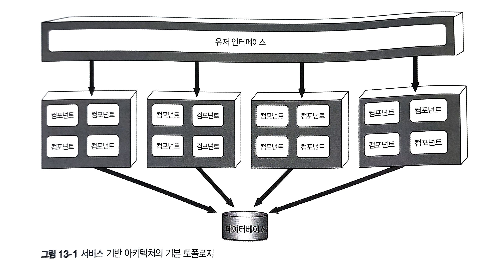
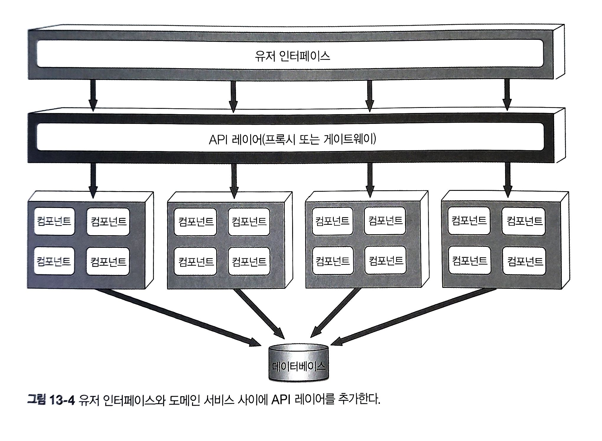
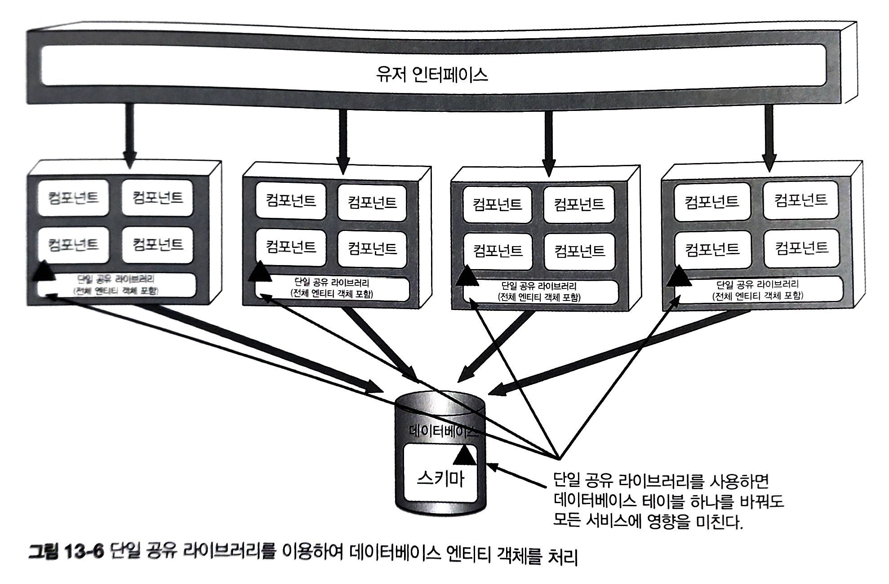
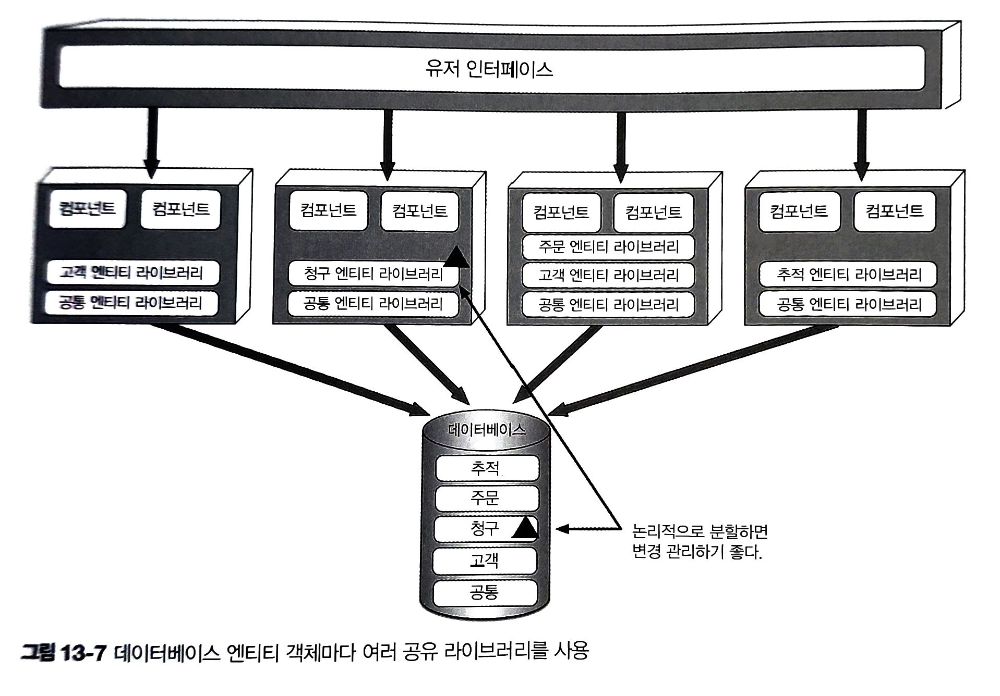
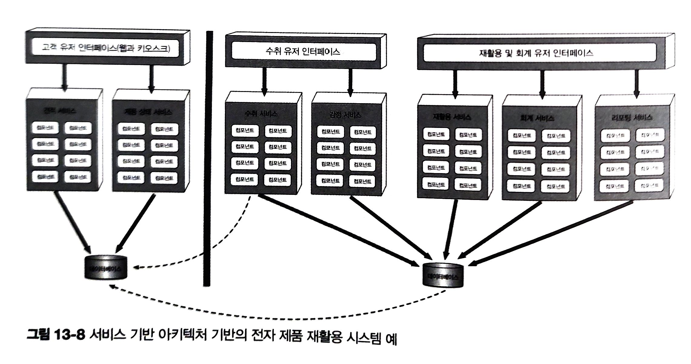

# 13. 서비스 기반 아키텍처 스타일

---

## 13.1 토폴로지

기본 토폴로지
- 따로 배포된 유저 인터페이스, 원격 서비스
    - 여기서 서비스는 '애플리케이션의 일부'
- 모놀리스 데이터베이스
- 대규모 분산 레이어 구조

---

---

- 도메인 서비스는 각각 단일 인스턴스로 배포
    - 여러 개도 가능. 유저 인터페이스 요청 -> 서비스 인스턴스 흘러가도록 부하 분산
- 중앙 공유 데이터베이스 사용 -> DB 변경이 이슈 될 수 있음 -> 13.4

--- 

## 13.2 토폴로지 변형

---

- 유저 인터페이스를 도메인 기반, 서비스 기반으로 쪼갤 수 있다.
- 단일 모놀리식 DB 역시 개별 DB로 분리할 수 있다.
  - 각 DB의 도메인 데이터를 다른 DB에서 필요로 하지 않도록 설계 해야 함
- 리버스 프록시, 게이트웨이로 구성된 API 레이어 둘 수 있음

---

---

## 13.3 서비스 설계 및 세분도

---

서비스를 어떻게 설계하든 도메인 서비스는 유저 인터페이스에서 비즈니스 기능을 호출하기 위해 접속할 일종의 API 액세스 퍼사드 필요
- API 액세스 퍼사드는 유저 인터페이스를 통해 유입된 비즈니스 요청을 오케스트레이트 하는 역할
- e.g. 주문 접수 -> OrderService 도메인 서비스이 API 엑세스 퍼사드가 받아 -> 내부에서 주문 처리, 주문 ID 생성, 결제 처리 -> 주문이 완료된 제품별 재고 정보 업데이트

---

단일 도메인 서비스 -> ACID DB 트랜잭션 
마이크로서비스 -> BASE 분산 트랜잭션
- 여기서 ACID 레벨의 데이터 무결성은 지원하지 않는다.

---

### Case

상황 : 어느 고객이 주문하고 결제 화면에서 만료된 신용카드로 결제

MSA에서는 어떻게 처리해야 할까? 고려해야 하는 부분은?
- OrderPlacement 서비스는 주문 접수/생성 -> orderId 채번 -> order 테이블에 데이터 삽입
- 모든 작업 완료 후, PaymentService 원격 호출 -> 결제 처리 진행
- 신용카드 유효 기간 만료 -> 결제 불가, 주문 처리 진행 불가
    - 비일관된 상태(주문 데이터는 DB에 있으나 승인이 이루어지지 않음)
- 여기서 더 고려해야 하는 부분?
    - 재고 차감을 할 것인지?
    - 재고가 거의 바닥났는데 다른 유저가 동일한 제품을 주문하면 가능하게 해야 할지?
    - 등등

---

## 13.4 데이터베이스 분할

여러 서비스에서 하나의 DB 사용 -> 테이블 스키마 변경 시 모든 서비스에 영향

1. 단일 공유 라이브러리 사용
- 가장 비효율적인 방법
  - 이유 : 테이블 구조가 변경 -> 단일 공유 라이브러리도 변경 -> 테이블 사용 여부 상관 없이 매번 재배포 필요
  - 개선안 : 버저닝 -> 어느 서비스가 실제 테이블 변경에 영향을 받을지 미리 알기 어려움

---

---

2. 연합 공유 라이브러리 : DB를 논리적으로 분할
- 특정 논리 도메인에 속한 테이블 변경 시, 해당 공유 라이브러리를 쓰는 곳만 영향을 받음

---

---

## 13.5 아키텍처 예시

---

- 높은 처리량이 필요한 견적 서비스, 제품 상태 서비스 별도 DB 구성하여 확장성 처리
- DB를 외부 고객, 내부 처리용으로 물리적 분할
- 방화벽 : 내부 서비스는 고객 정보 조회/수정 가능하나 반대는 불가능

---

---

# 13.6 아키텍처 특성 등급

- 분할 유형 : 도메인
- 퀀텀 수 : 하나 이상
- 4점 : 배포성, 내고장성, 모듈성, 전체 비용, 신뢰성, 시험성
- 3점 : 진화성, 성능, 확장성, 단순성
- 2점 : 탄력성

--- 

# 13.7 언제 이 아키텍처 스타일 사용하는가?

- 서비스 기반 아키텍처는 도메인 주도 설계와 궁합이 잘 맞는다.
- 실용적이다.
- 다른 분산 아키텍처에 비해 ACID 트랜잭션이 더 잘 보존된다.
- 모듈성을 괜찮은 수준으로 달성할 수 있다.