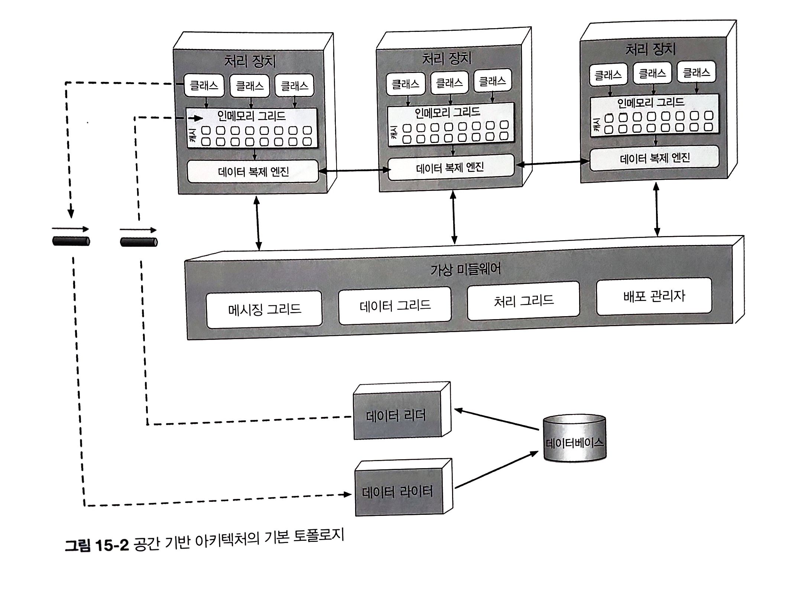
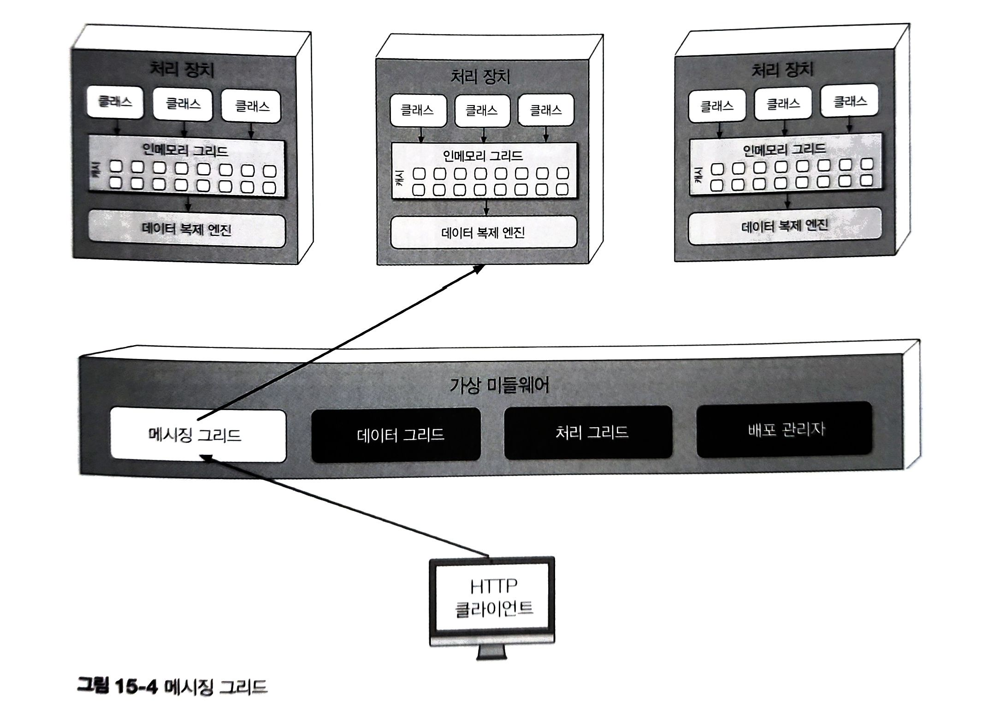
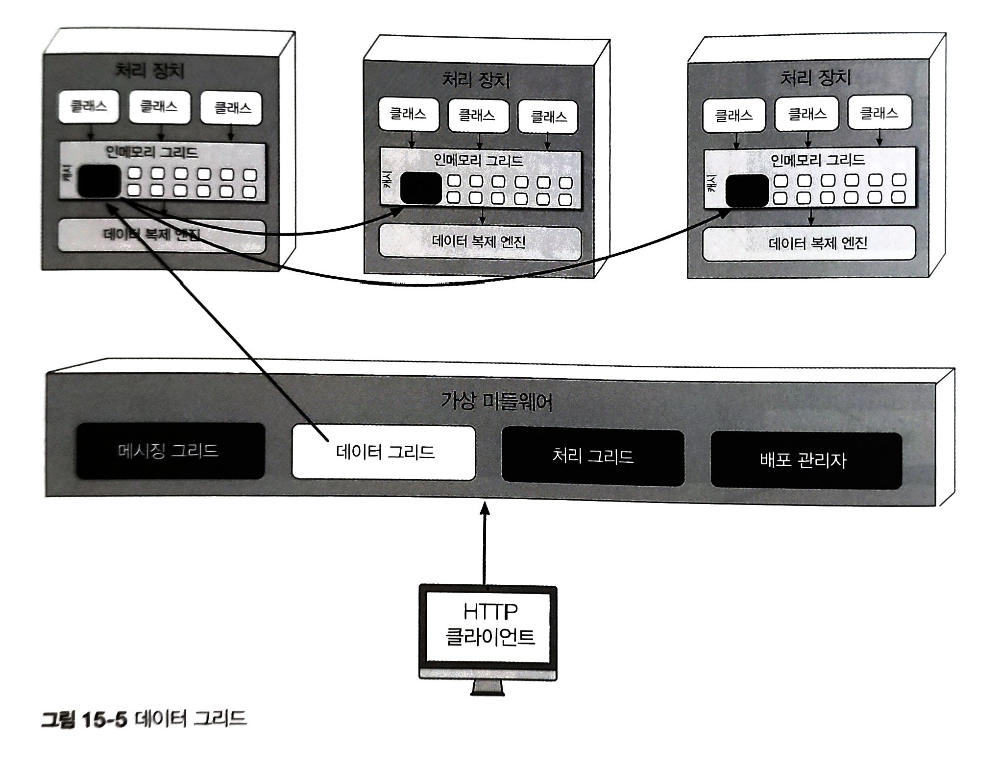
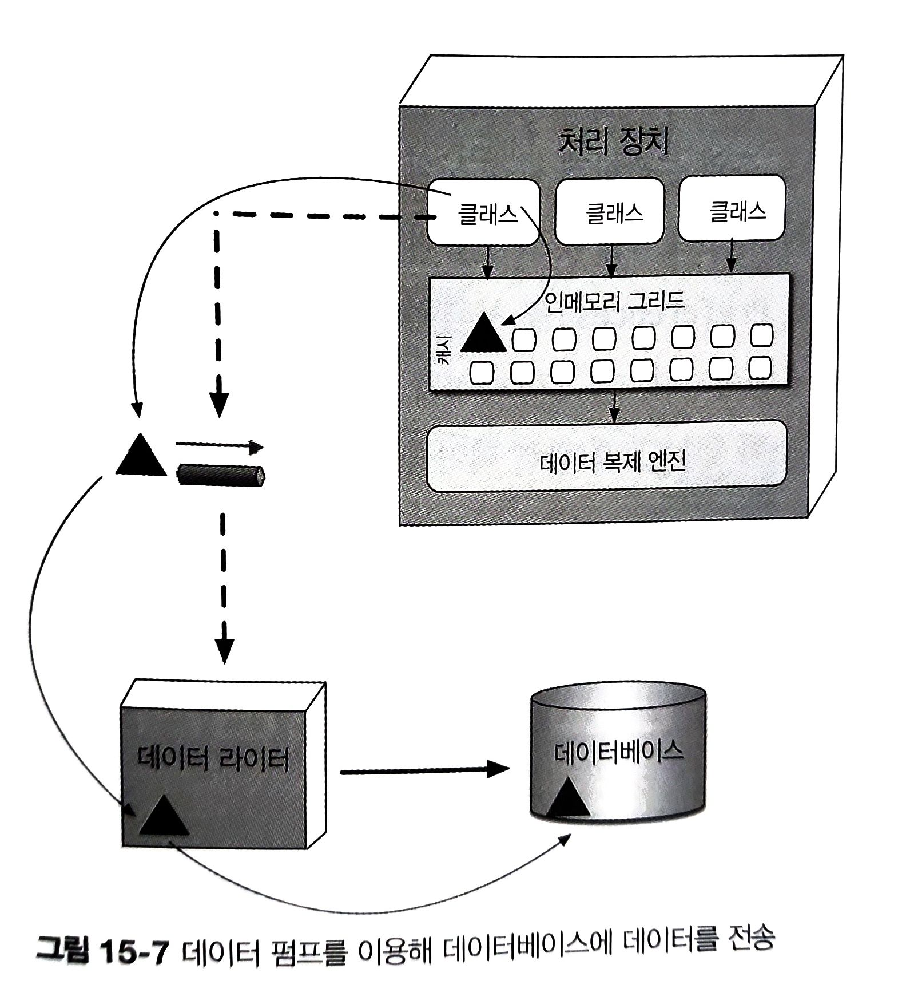
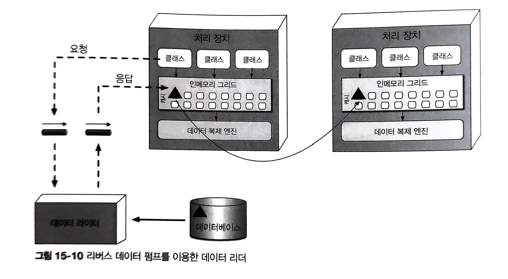
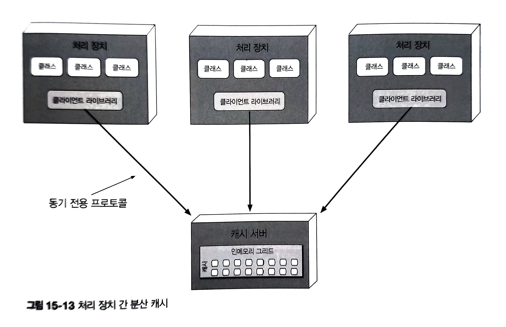

# 15. 공간 기반 아키텍처 스타일

---

웹 기반 흐름 : 웹 서버 -> 어플리케이션 서버 -> 데이터베이스 서버
- 유저 수 증가 -> 일반적으로 웹 서버 확장
- 이 방식의 한계 -> 병목이 어플리케이션 서버, 데이터베이스 서버로 이동

공간 기반 아키텍처 스타일 : 높은 확장성, 탄력성, 동시성 및 이와 관련된 문제를 해결하기 위해 설계된 아키텍처 스타일
- 동시 유저 수가 가변적이라서 예측이 곤란한 어플리케이션에서도 유용

---

## 15.1 기본 토폴로지

튜플 : 공유 메모리 통해 통신하는 다중 병렬 프로세서 사용
- 중앙 DB 없애고, 복제된 인메모리 데이터 그리드 활용 -> 확장성, 탄력성, 성능 높임

공간기반 아키텍처의 구성
- 처리 장치(애플리케이션 코드)
- 처리 장치를 관리/조정하는 가상 미들웨어
- 업데이트 된 데이터 비동기 전송하는 데이터 펌프
- 데이터 펌프에서 데이터를 받아 업데이트를 수행하는 데이터 라이터
- 데이터 베이스의 데이터를 읽어 전달하는 데이터 리더

---

---

### 15.1.1 처리 장치

애플리케이션 로직, 웹 기반 컴포넌트와 백엔드 비즈니스 로직 등 포함

### 15.1.2 가상 미들웨어

아키텍처 내부에서 데이터 동기화 요청 및 요청 처리 다양한 부분 제어하는 인프라 담당

- 메시징 그리드
- 데이터 그리드
- 처리 그리드
- 배포 관리자

---

### 메시징 그리드

입력 요청과 세션 상태 관리
- 가상 미들웨어에 요청 유입 -> 어떤 활성 처리 장치가 요청을 받아 처리할지 결정 후 전송
- 메시지 그리드의 복잡도는 단순(라운드 로빈)한 것부터 복잡한 것까지 다양한 알고리즘 존재
- 부하 분산이 가능한 일반 웹 서버(HA 프록시, Nginx)로 구현

---

---

### 데이터 그리드

요즘에는 거의 대부분 복제 캐시로 처리 장치에만 구현
- 외부 컨트롤러가 필요한 복제 캐시 구현체나 분산 캐시 사용 시, 가상 미들웨어 내부 데이터 그리드 컴포넌트에도 함께 위치

각 처리 장치는 자신의 인메모리 데이터 그리드에 정확하게 동일한 데이터를 가지고 있어야 함
- 실제 데이터 동기화는 비동기 방식으로 신속하게, 100ms 미만으로 이루어짐

---

---

### 처리 그리드

필수 컴포넌트는 아님. 다수의 처리 장치가 단일 비즈니스 요청을 처리할 경우 요청 처리 오케스트레이트

### 배포 관리자

부하 조건에 따라 처리 장치 인스턴스를 동적으로 시작/종료하는 컴포넌트 

---

### 15.1.3 데이터 펌프

데이터를 다른 프로세서에 보내 데이터베이스를 업데이트 하는 장치

공간 기반 아키텍처는 처리 장치가 데이터를 데이터베이스에서 직접 읽고 쓰지 않으므로 반드시 필요

데이터 펌프는 메시징 기법으로 구현(큐)
- 처리 장치와 데이터 라이터를 분리할 수 있기 때문에 데이터 라이터를 사용할 수 없는 경우에도 처리 장치에서 무중단 처리가 가능

---

---

### 15.1.4 데이터 라이터

데이터 펌프에서 메시지를 받아 그에 맞게 데이터베이스를 업데이트 하는 컴포넌트

처리장치가 여러 개에 데이터 라이터를 하나만 둘 수도 있고, 여러 개를 둘 수도 있음

### 15.1.5 데이터 리더

데이터베이스에서 데이터를 읽어 리버스 데이터 펌프를 통해 처리 장치로 실어 나르는 컴포넌트

인스턴스가 모두 다운되면 데이터는 데이터베이스에서 읽어 와야 함
- 처리 장치가 살아나면 인스턴스는 캐시에서 락을 획득하려 함
- 임시 캐시 소유자 인스턴스, 데이터 요청 큐에 메시지 보내 캐시 로드
- 데이터 리더가 DB 쿼리, 얻은 데이터를 다른 큐(리버스 데이터 펌프)로 보냄
- 임시 캐시 소유자 인스턴스, 데이터 받아 캐시 로드, 락 해제

---

---

## 15.3 클라우드 대 온프레미스 구현

공간 기반 아키텍처에서는 클라우드, 온프렘을 혼합해서 구성이 가능

물리 DB 온프레미스에 둔 상태로,
클라우드 기반의 환경에서 처리 장치와 가상 미들웨어 통해 앱 배포
-> 하이브리드 클라우드 환경 가능

---

## 15.4 복제 캐시 대 분산 캐시

복제 캐시는 공간 기반 아키텍처의 표준 모델. 속도가 빠르고 내고장성 지원.
-> 데이터량이 엄청 많거나, 캐시 데이터가 너무 빈번하게 업데이트 되면 복제 캐시 사용 불가
-> 이 경우 분산캐시를 사용하면 도움이 됨

분산 캐시를 구현하려면 중앙 캐시를 갖고 있는 전용 외부 서버/서비스가 필요
- 처리 장치는 데이터를 내부 메모리에 저장하는 대신, 전용 프로토콜을 통해 중앙 캐시 서버에 있는 데이터를 액세스
- 모든 데이터가 한 곳에 있고 복제할 필요 없으니 높은 데이터 일관성 보장
- 캐시 데이터를 원격에서 가져와야 하므로 복제 캐시보다 성능이 낮고 시스템 전체 레이턴시가 증가

---

---

|결정 기준|복제 캐시|분산 캐시|
|---|---|---|
|최적화|성능|일관성|
|캐시 크기|작다(<100MB)|크다(>500MB)|
|데이터 유형|교적 정적임|매우 동적임|
|업데이트 빈도|비교적 낮음|매우 높음|
|내고장성|좋음|나쁨|

---

# 15.5 니어 캐시

분산 캐시(풀 백킹 캐시)와 인메모리 데이터 그리드(프런트 캐시)를 접합한 일종의 하이브리드 캐시 모델
- 프런트 캐시는 항상 풀 백킹 캐시보다 작은 서브셋을 담고 있고, 방출 정책을 통해 옛 항목을 삭제한 후 최근 항목을 추가
- 프런트 캐시는 가장 최근에 사용한 항목이 포함된 MRU 캐시 또는 가장 자주 사용한 항목이 포함된 MFU 캐시로 사용

## 15.6 구현 예시

### 15.6.1 콘서트 티켓 판매 시스템

평소 동시 유저 수 적음. 인기 있는 콘서트 -> 동시 유저 수 수백~수천 급등

좌석 가능 여부가 신속하게 업데이트 되어야 함
- 시스템이 계속 중앙 DB에 동기적으로 액세스 하면 머지않아 작동 멎음

배포 관리자가 동시 유저 수 치솟는 타이밍 체크 후 대량 요청을 감당할 수 있도록 다수의 처리 장치 기동
이상적, 미리 처리 장치 충분히 가동 시켜 놓고, 부하 급등 직전까지 유휴 상태로 놔둠

---

### 15.6.2 온라인 경매 시스템

고도의 성능과 탄력성 요구
경매 시작 시 얼마나 많은 사람이 참여할 지 예측할 도리가 없음

부하 증가 시, 공간 기반 아키텍처 방식으로 처리 장치를 여럿 기동하는 방식 적합
- 경매가 끝나면 사용하지 않는 처리 장치는 삭제
- 각 처리 장치를 각 경매마다 할당하면 입찰 데이터의 일관성도 보장 가능
- 데이터 펌프는 원래 비동기로 작동하므로 입찰 데이터를 긴 레이턴시 없이 다른 처리장치(e.g. 입찰 이력 등)로 보낼 수 있음