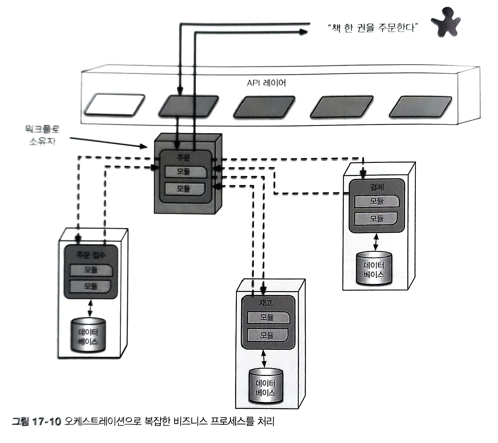

# Ch 17. 마이크로서비스 아키텍처 스타일

---

## 17.1 역사

- 마이크로서비스는 도메인 주도 설계(DDD) 영향을 많이 받음
- 디커플링 스타일을 나타낸 경계 콘텍스트(bounded context) 개념에 영향을 받음

---

In short, the microservice architectural style is an approach to developing a single application as a suite of small services, each running in its own process and communicating with lightweight mechanisms, often an HTTP resource API. These services are built around business capabilities and independently deployable by fully automated deployment machinery. There is a bare minimum of centralized management of these services, which may be written in different programming languages and use different data storage technologies.

- https://martinfowler.com/articles/microservices.html

---

---

## 17.3 분산

서비스를 디커플링하면 어플리케이션을 호스트하는 육중한 멀티테넌트 인프라 아키텍처에서 자주 발생하는 문제들을 해결 가능
- e.g. 네트워크 대역폭, 메모리, 디스크 공간 등 재사용 가능

다만, 일부 리소스는 공유 인프라의 제약을 받을 수 있다. 
잘못된 분리도 문제가 될 수 있다.
- 이러한 문제는 각 서비스를 자체 프로세스로 분리하면 자연스럽게 해소

---

성능은 다소 아쉬움
네트워크 호출은 메서드 호출보다 오래 걸리고 엔드포인트마다 보안 검증 절차 거치면 처리 시간 소요
-> 서비스 세분도 고려 필요

서비스 경계를 넘나드는 트랜잭션을 사용하지 않도록 견고
- 결국 얼마나 세분화 할 것인가 잘 결정하는 것이 중요

---

## 17.4 경계 콘텍스트

경계 컨텍스트 : 서비스나 도메인마다 워크플로를 모델링하는 개념

모놀리식 -> 공통 클래스(e.g. Address)를 다른 어플리케이션 파트의 개발자가 공유 가능
마이크로서비스 -> 커플링을 삼가야 하므로, 커플링 보다는 중복이 낫다고 판단

마이크로서비스 : 도메인 주도 설계의 논리적인 개념을 물리적으로 구현한 개념

---

### 17.4.1 세분도

세분도를 나누는 기준
1. 목적 : 이 아키텍처 스타일의 본래 의도인 도메인
2. 트랜잭션 : 여러 엔티티가 함께 개입하여 작동하는 트랜잭션은 좋은 서비스 경계 후보
3. 코레오그래피 : 필요에 따라 통신 오버헤드를 줄이기 위해 더 큰 서비스로 뭉치는 것을 고려해야 할 수도 있음

### 17.4.2 데이터 격리

마이크로서비스는 경계 콘텍스트 개념에 따라 데이터 격리 필요

---

## 17.5 API 레이어

필수는 아니지만, 대부분 여러 시스템 컨슈머 사이에 API 레이거가 존재.

아키텍처의 철학에 충실하려면, API 레이어를 중재자나 오케스트레이션 도구로 사용하지 말아야 함
- 모든 비즈니스 로직은 경계 콘텍스트 내부에서 일어나야 하며, 오케스트레이션 등의 다른 로직을 중재자에 넣는 것은 경계 위반

---

## 17.6 운영 재사용

마이크로서비스는 커플링보다 복제를 선호
- 모니터링, 로깅 등 운영 측면에서 커플링이 유리한 아키텍처는 어떻게 하면 좋을까?
- 마이크로서비스는 운영과 도메인 두 가지 관심사를 분리

이 문제를 해결하는 방법이 사이드카 패턴(sidecar pattern)

---

---

공통 운영 관심사를 각 서비스마다 별도의 컴포넌트에 두고, 해당 팀이나 공유 인프라팀이 소유할 수 있도록 함

각 서비스에는 공통 사이드카가 포함돼 있으므로 서비스 메시(service mesh)를 구축하면 로깅, 모니터링 등 관심사를 아키텍처 전체적으로 일원화

서비스 디스커버리 : 어느 하나 서비스를 직접 호출하는게 아니라, 모든 요청이 서비스 디스커버리를 거치도록 하여 요청 수와 빈도 모니터링

---

## 17.8 통신

- 프로토콜 인지(protocol-aware) : 마이크로서비스는 운영 커플링을 방지하고자 중앙 통합 허브를 갖고 있지 않기 때문에 각 서비스는 다른 서비스를 호출하는 방법을 알고 있어야 함
- 이종(heterogeneous) : 각 서비스마다 구현 기술 스택이 상이할 수 있음. 폴리글랏(polyglot) 환경 지원
- 상호 운용성(interoperability) : 여러 서비스가 서로 호출. 마이크로서비스에서 트랜잭셔널 메서드 호출은 권장하지 않지만, 필요한 경우 정보를 주고받으며 협력해야 함

---

### 17.8.1 코레오그래피와 오케스트레이션

코레오그래피 : 브로커 기반의 아키텍처 통신 스타일과 동일. 중앙 중재자가 따로 없고, 경계 콘텍스트 철학에 충실

시나리오 : 유저 위시 리스트의 상세 정보 요청

필요한 정보가 CustomerWishList 서비스에 있는 건 아니어서 CustomerDemographics 서비스를 호출해 모자란 정보를 보충한다.

---

---

MSA는 전역 중재자가 없음
-> 여러 서비스를 조정해야 하는 경우는 스스로 로컬 중재자를 만들 수 있다.

---

---

조금 더 복잡한 워크플로

처음 호출된 서비스는 자신의 다른 도메인 책임과 더불어 여러 타 서비스를 전체적으로 조정하는 중재자 역할도 겸함
-> 이러한 패턴을 프론트 컨트롤러 패턴이라고 함

---

---

복잡한 비즈니스 워크플로는 오케스트레이션을 사용하는 방법도 있음

---

---

분산 애플리케이션에서는 데이터베이스 역시 디커플링이 필요
-> 모놀리식에서 문제가 아니었던 원자성 문제도 발생

트랜잭션 자체 - MSA 핵심 원칙인 디커플링에 위배
-> 트랜잭션을 여러 서비스에 걸쳐 만들고 싶다면, 그렇게 하지 말고 컴포넌트 세분도를 바로 잡아라

예외적으로 필요한 경우도 있어,
사가 패턴 : 분산 트랜잭션 패턴
- 중재자는 트랜잭션을 구성하는 파트를 하나씩 호출하여 성공/실패 여부 기록
- 모두 잘 흘러가면 모든 값과 데이터 레코드는 동기 업데이트가 이루어진다.

---

---

사가 패턴에서는 에러가 나면 트랜잭션 보상 처리
- 첫 번째 파트 성공, 두 번째 파트 실패
- 중재자는 지금까지 성공한 모든 트랜잭션 파트에 과거에 처리했던 내용을 undo 하라 함
-> 이렇게 하면 설계, 구현, 디버깅 작업량이 2배 이상 늘어나서 굳이 MSA를 하는 이유가 없음

---

--- 

## 17.9 아키텍처 특성 등급

- 전체 비용, 성능, 단순성 빼고 나머지는 다 점수가 높음